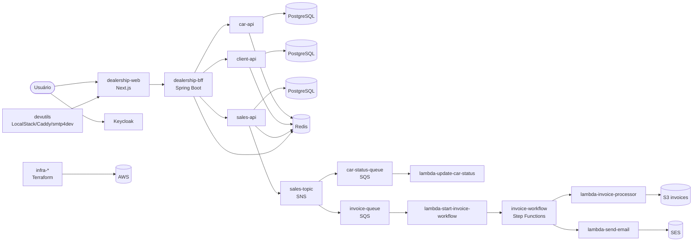
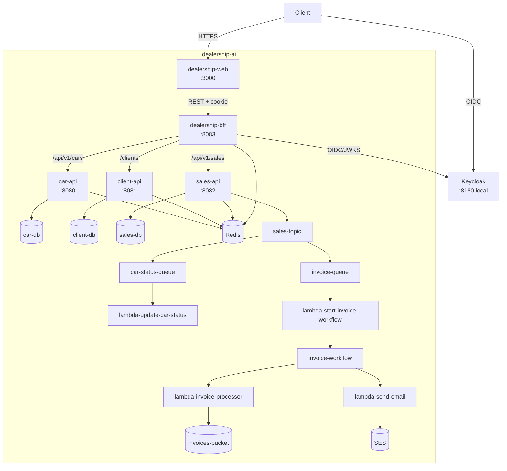
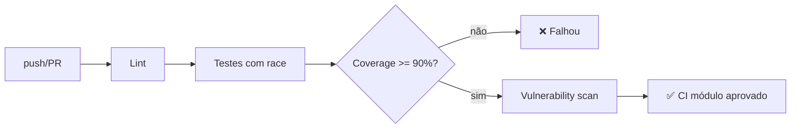

# dealership-ai

> Plataforma de concessionária cloud-native para equipes que querem estudar um fluxo completo de venda de veículos com microsserviços, event-driven e automação com AI agents.

## 1. O que é este projeto?
O `dealership-ai` simula uma operação de concessionária ponta a ponta: catálogo de veículos, cadastro de clientes, compra, faturamento assíncrono e notificação por e-mail.

Além do domínio de negócio, ele é um estudo de caso técnico orientado a engenharia assistida por IA (Copilot + Spec Kit), com estrutura de especificação/planejamento (`.specify`) e instruções/skills para agentes. Em relação ao projeto original `dealership`, este repositório amplia o escopo para uma arquitetura distribuída com frontend Next.js, BFF, APIs de domínio, Lambdas em Go e infraestrutura modular em Terraform.

## 2. Arquitetura Geral do Sistema
O estilo arquitetural é **microsserviços + BFF + event-driven** em um monorepo: o frontend chama apenas o BFF; o BFF orquestra APIs de domínio; e o `sales-api` publica eventos para processamento assíncrono por filas, Lambdas e Step Functions.

### Diagrama de Contexto (C4 Nível 1)


### Diagrama de Containers (C4 Nível 2)


## 3. Módulos do Repositório
Tabela com todos os módulos existentes e planejados.

| Módulo | Linguagem | Status | Responsabilidade |
|--------|-----------|--------|-----------------|
| `car-api` | Java 25 / Spring Boot | ✅ Disponível | Catálogo de veículos (CRUD, filtros, imagens, status) |
| `client-api` | Java 25 / Spring Boot | ✅ Disponível | Perfil de clientes, ownership e dados sensíveis |
| `sales-api` | Java 25 / Spring Boot | ✅ Disponível | Registro de vendas e publicação de evento de venda |
| `dealership-bff` | Java 25 / Spring Boot | ✅ Disponível | Orquestração entre frontend e APIs de domínio |
| `dealership-web` | TypeScript / Next.js | ✅ Disponível | Interface web para catálogo, conta e compra |
| `lambda-update-car-status` | Go 1.25 | ✅ Disponível | Consome venda e atualiza carro para `SOLD` |
| `lambda-start-invoice-workflow` | Go 1.25 | ✅ Disponível | Inicia a Step Function a partir da `invoice-queue` |
| `lambda-invoice-processor` | Go 1.25 | ✅ Disponível | Gera invoice HTML e salva em S3 |
| `lambda-send-email` | Go 1.25 | ✅ Disponível | Envia invoice por e-mail via SES |
| `infra-vpc` | HCL (Terraform) | ✅ Disponível | VPC, sub-redes, NAT, NLB e ECS cluster base |
| `infra-databases` | HCL (Terraform) | ✅ Disponível | Aurora PostgreSQL dos serviços de domínio |
| `infra-elasticache` | HCL (Terraform) | ✅ Disponível | Redis dedicado por serviço |
| `infra-ecr` | HCL (Terraform) | ✅ Disponível | Repositórios de imagens dos containers |
| `infra-parameters` | HCL (Terraform) | ✅ Disponível | Parâmetros SSM compartilhados |
| `infra-secrets` | HCL (Terraform) | ✅ Disponível | Secrets Manager (credenciais e segredos) |
| `infra-s3` | HCL (Terraform) | ✅ Disponível | Buckets de imagens e invoices |
| `infra-ses` | HCL (Terraform) | ✅ Disponível | Identidade de envio de e-mail |
| `infra-sns` | HCL (Terraform) | ✅ Disponível | Tópico SNS de vendas (`sales-topic`) |
| `infra-sqs` | HCL (Terraform) | ✅ Disponível | Filas, DLQs e subscriptions de fanout |
| `infra-step-function` | HCL (Terraform) | ✅ Disponível | Orquestração do workflow de invoice |
| `devutils` | Shell/Docker/Java/TS | ✅ Disponível | Ambiente local (LocalStack, Keycloak, smtp4dev, Caddy) |
| `devutils/keycloak-self-registration-listener` | Java 21 | ✅ Disponível | Plugin Keycloak para autoatribuição de grupo no cadastro |
| `devutils/keycloakify-theme` | TypeScript/React | ✅ Disponível | Tema customizado de login do Keycloak |
| `docs` | Markdown/Drawio | ✅ Disponível | ADRs, diagramas e artefatos de arquitetura |
| `Start Invoice Worflow` | N/A | 🔜 Em breve | Diretório de rascunho/placeholder legado |

Para documentação detalhada de cada módulo, consulte o README.md dentro de cada diretório.

## 4. Tecnologias Utilizadas
Visão consolidada de todas as tecnologias do projeto.

| Camada | Tecnologia | Versão |
|--------|------------|--------|
| Backend | Java | 25 |
| Framework backend | Spring Boot | 4.0.5 / 4.0.6 |
| Frontend | Next.js | 16.2.4 |
| UI Runtime | React | 19.2.4 |
| Linguagem frontend | TypeScript | 5.x |
| Serverless | Go | 1.25 |
| Mensageria | AWS SNS + SQS | gerenciado AWS |
| Orquestração assíncrona | AWS Step Functions | gerenciado AWS |
| Banco relacional | Aurora PostgreSQL | 16.4 |
| Cache | Redis (ElastiCache) | 7.1 |
| Infraestrutura | Terraform | >= 1.5.0 |
| Provider cloud | hashicorp/aws | ~> 5.0 |
| Containerização | Docker / Docker Compose | Compose v2 |
| Plataforma cloud local | LocalStack Pro | 4.14.0 |
| Identidade | Keycloak | 26.2.x |
| CI | GitHub Actions | workflow em YAML |

## 5. Pré-requisitos Globais
Liste o que o desenvolvedor precisa instalar antes de trabalhar em qualquer módulo:

- Java 25+
- Maven 3.9+ (ou usar `mvnw`/`mvnw.cmd`)
- Node.js 22+ e npm 10+
- Go 1.25+
- Docker 24+ e Docker Compose v2
- Terraform 1.5+
- `curl`
- `LOCALSTACK_AUTH_TOKEN` (para subir o stack local completo do `devutils`)

## 6. Início Rápido (Quick Start)
O menor número de comandos para ter o sistema funcionando localmente.

```bash
# Clone
git clone https://github.com/Joao-Victorsg/dealership-ai.git
cd dealership-ai

# Infra local compartilhada (LocalStack, Keycloak, smtp4dev, Caddy)
docker compose -f devutils/docker-compose.yml up -d

# Backends (execute em terminais separados)
cd car-api && ./mvnw clean spring-boot:run
cd ../client-api && ./mvnw clean spring-boot:run
cd ../sales-api && ./mvnw clean spring-boot:run
cd ../dealership-bff && ./mvnw clean spring-boot:run

# Frontend
cd ../dealership-web
npm ci && npm run dev

# Health check exemplo
curl http://localhost:8083/actuator/health
```

## 7. Fluxo de Desenvolvimento

### Branches e Convenções
A estratégia praticada no repositório é **trunk-based em `master`** com branches curtas por mudança (`feat/*`, `fix/*`, `docs/*`) e integração via Pull Request. O histórico segue padrão de commit semântico (**Conventional Commits**), por exemplo: `feat(...)`, `fix(...)`, `test(...)`, `docs(...)`.

### Fluxo de CI/CD


Atualmente, o workflow versionado no repositório está em `lambda-update-car-status/.github/workflows/ci.yml` (GitHub Actions). Os demais módulos seguem quality gates locais por módulo (`mvnw verify`, `npm run test`, `go test ./...`) e podem ser expandidos para workflows equivalentes.

## 8. Decisões Arquiteturais Globais (ADRs)
Documente as decisões que afetam todo o projeto:

| # | Decisão | Status | Justificativa resumida |
|---|---------|--------|------------------------|
| 1 | Monorepo com submódulos de aplicação e infraestrutura | Aceito | Evolução coordenada entre frontend, BFF, APIs, Lambdas e Terraform |
| 2 | Frontend integra apenas com o BFF | Aceito | Reduz acoplamento da UI com APIs de domínio e centraliza autenticação |
| 3 | Fanout de eventos em `infra-sns` + `infra-sqs` | Aceito | Separa ownership de publicação e consumo com isolamento por DLQ |
| 4 | Invoice workflow usa `SaleEventPayload` completo | Aceito | Evita lambdas de enriquecimento e simplifica orquestração |
| 5 | Terraform modular com `remote_state` entre módulos | Aceito | Evita ARNs hardcoded e facilita composição incremental da infraestrutura |

## 9. Contribuindo
Como um novo desenvolvedor contribui para o projeto:

1. Leia os READMEs individuais de cada módulo antes de começar.
2. Abra uma issue descrevendo a mudança proposta.
3. Crie uma branch no padrão `feat/`, `fix/`, `docs/`, etc.
4. Abra um Pull Request com descrição clara.

## 10. Licença
Este projeto está licenciado sob a [MIT License](./LICENSE).
