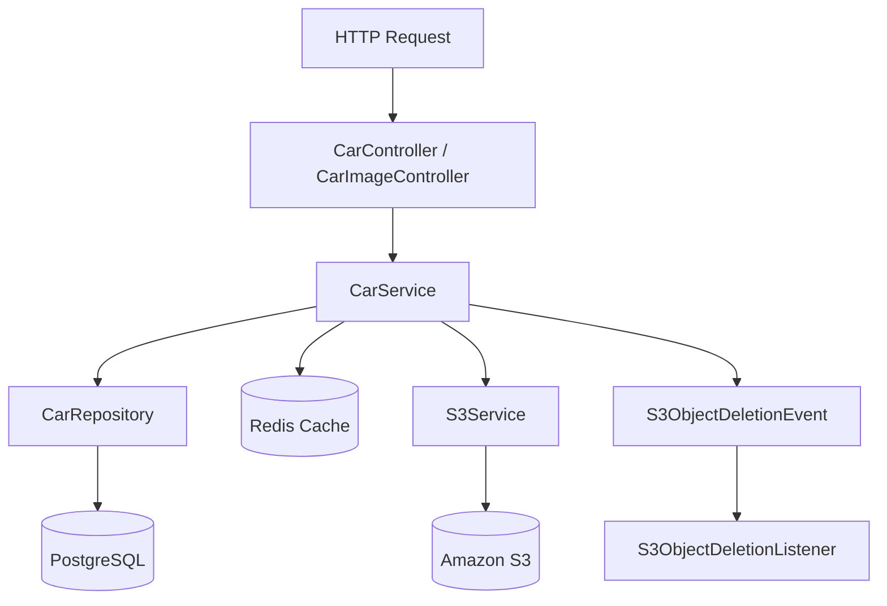
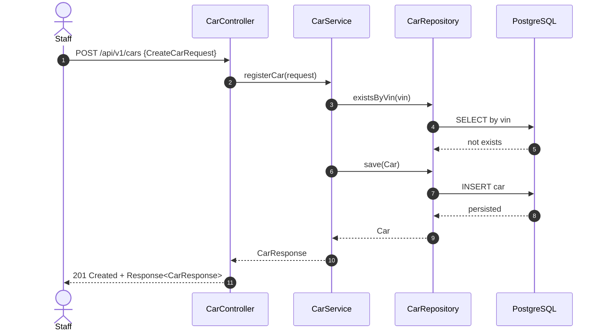
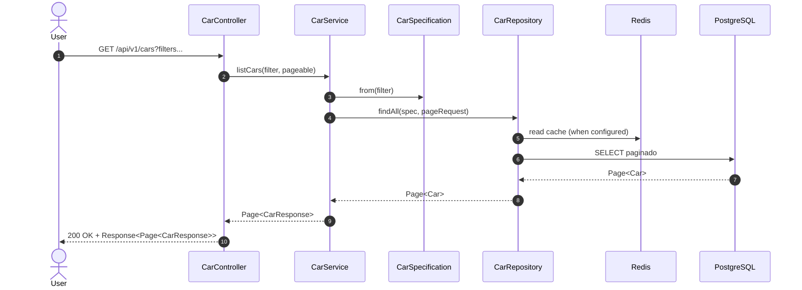
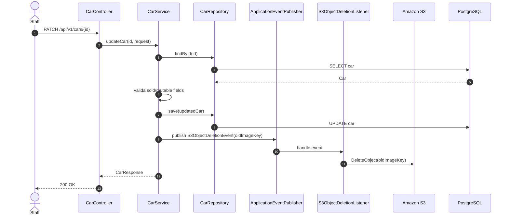
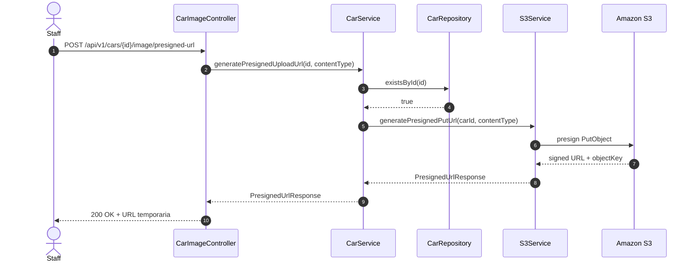
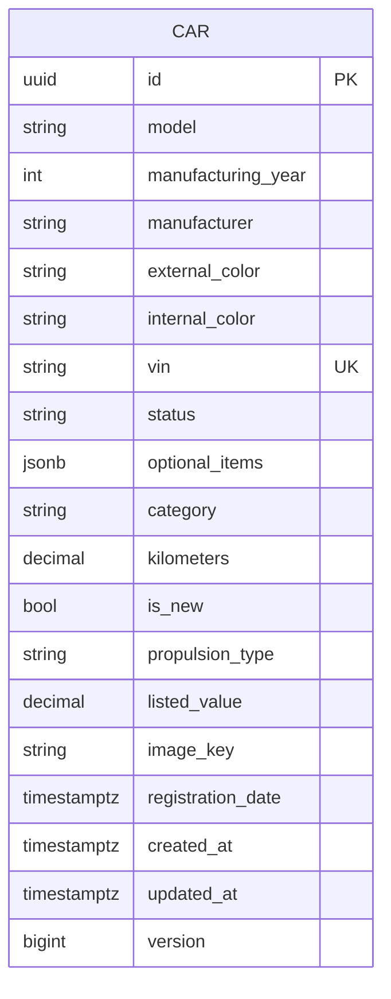

# car-api — Documentacao Tecnica

## 1. Visao Geral
`car-api` e o servico de inventario de veiculos do ecossistema `dealership-ai`: expõe endpoints REST para cadastro, consulta, filtragem e atualizacao de carros, incluindo gestao de imagem via URL pre-assinada S3, com regras de negocio de disponibilidade, validacao de VIN e protecao de concorrencia.

## 2. Stack de Tecnologias

| Tecnologia | Versao | Finalidade |
|------------|--------|------------|
| Java | 25 | Linguagem principal |
| Spring Boot | 4.0.5 | Runtime da API |
| Spring MVC | 4.0.5 (via Boot) | Camada HTTP REST |
| Spring Data JPA | 4.0.5 (via Boot) | Persistencia relacional |
| Hibernate | 7.x (via Boot 4.0.5) | ORM/JPA provider |
| PostgreSQL Driver | 42.x (via Boot) | Conexao com banco |
| Flyway | 11.x (via Boot) | Migracoes SQL |
| Spring Data Redis | 4.0.5 (via Boot) | Cache distribuido |
| Spring Security + OAuth2 Resource Server | 4.0.5 (via Boot) | Autenticacao/autorizacao JWT |
| AWS SDK for Java v2 (S3) | 2.25.60 | Presigned URL e delete de objeto |
| springdoc-openapi | 3.0.2 | Documentacao OpenAPI/Swagger |
| Lombok | 1.18.x (via Boot) | Reducao de boilerplate |
| Testcontainers | 2.x (via Boot) | Testes de integracao |
| Rest Assured | 6.0.0 | Testes HTTP |
| Instancio | 5.3.0 | Geracao de dados de teste |
| JaCoCo | 0.8.13 | Cobertura (gate 90%) |
| PIT Mutation Testing | 1.17.0 | Mutation testing (gate 90%) |
| Docker | Dockerfile multi-stage | Empacotamento e execucao |
| Terraform | >= 1.5.0 (`infra/`) | Provisionamento AWS do servico |

## 3. Estrutura de Diretorios

```text
car-api/
├── src/
│   ├── main/
│   │   ├── java/br/com/dealership/car/api/
│   │   │   ├── config/                 # Security, Redis, S3, OpenAPI, tratamento global de erro
│   │   │   ├── controller/             # Endpoints REST (/api/v1/cars...)
│   │   │   ├── domain/
│   │   │   │   ├── entity/             # Entidade Car
│   │   │   │   ├── enums/              # Status, categoria, propulsion, ordenacao
│   │   │   │   ├── exception/          # Excecoes de dominio
│   │   │   │   └── specification/      # Filtro dinamico (JPA Specification)
│   │   │   ├── dto/
│   │   │   │   ├── request/            # Payloads de entrada
│   │   │   │   └── response/           # Payloads de saida + envelope Response<T>
│   │   │   ├── repository/             # Repositorio JPA
│   │   │   └── service/                # Regras de negocio + S3 + eventos internos
│   │   └── resources/
│   │       ├── application.properties  # Config principal
│   │       ├── application-local.yml   # Overrides locais
│   │       └── db/migration/           # Flyway SQL
│   └── test/
│       ├── java/br/...                 # Testes unitarios
│       └── java/integrated/            # Testes de integracao (Failsafe)
├── infra/                              # Terraform (ECS, ALB, task definition, SG, logs)
├── compose.yaml                        # Postgres + Redis para dev local
├── Dockerfile                          # Imagem de producao com New Relic agent
└── pom.xml                             # Dependencias/build Maven
```

Arquivos relevantes adicionais:
- `src/main/resources/db/migration/V1__create_car_table.sql`: schema inicial da tabela `car`.
- `src/main/resources/db/migration/V2__add_version_and_timestamptz.sql`: lock otimista e timestamps com timezone.
- `src/main/java/.../service/CarService.java`: orquestracao principal de cadastro, consulta e update.

## 4. Arquitetura
Padrao principal: **arquitetura em camadas (Controller -> Service -> Repository)** com separacao clara de DTOs e dominio. O modulo aplica REST para exposicao HTTP, JPA Specification para filtros dinamicos, cache Redis para consultas frequentes e integracao com S3 para upload de imagem por URL pre-assinada. Atualizacao de imagem usa evento interno (`S3ObjectDeletionEvent`) para limpeza assíncrona do objeto antigo apos mudanca.

Conceitos-chave no contexto do modulo:
- **REST**: endpoints versionados em `/api/v1/cars`.
- **DTO + Envelope Response**: contratos de entrada/saida desacoplados da entidade.
- **Optimistic Locking**: `@Version` em `Car` para concorrencia.
- **Caching**: caches `car-by-id`, `car-listings`, `car-filter-options`.
- **JWT RBAC**: GET publico; POST/PATCH restritos a `ROLE_STAFF`/`ROLE_ADMIN`.

### Diagrama de Arquitetura em Camadas


## 5. Fluxos Principais (Diagramas de Sequencia)

### Fluxo: registrar carro (POST /api/v1/cars)


### Fluxo: listar carros com filtros (GET /api/v1/cars)


### Fluxo: atualizar status/valor/imagem (PATCH /api/v1/cars/{id})


### Fluxo: gerar URL pre-assinada de upload (POST /api/v1/cars/{id}/image/presigned-url)


## 6. Modelos de Dados

```text
Entidade: Car
├── id: UUID (PK, gerado automaticamente)
├── model: String (not null, max 255)
├── manufacturingYear: Integer (not null, >= 1886)
├── manufacturer: String (not null, max 255)
├── externalColor: String (not null, max 100)
├── internalColor: String (not null, max 100)
├── vin: String (not null, unico, 17 chars alfanumericos)
├── status: Enum CarStatus (AVAILABLE|SOLD|UNAVAILABLE)
├── optionalItems: List<String> (JSONB)
├── category: Enum CarCategory
├── kilometers: BigDecimal (not null, >= 0)
├── isNew: Boolean (not null)
├── propulsionType: Enum PropulsionType
├── listedValue: BigDecimal (not null, > 0)
├── imageKey: String (nullable, max 500)
├── registrationDate: Instant
├── createdAt: Instant
├── updatedAt: Instant
└── version: Long (@Version para optimistic locking)
```

Validacoes de negocio importantes:
- VIN sempre uppercase e unico.
- `isNew=true` exige `kilometers=0`; usado exige `kilometers>0`.
- Carro SOLD nao pode ser modificado.
- `UpdateCarRequest` exige pelo menos um campo.



## 7. Configuracao e Variaveis de Ambiente

| Variavel | Descricao | Obrigatoria | Exemplo |
|----------|-----------|-------------|---------|
| `SERVER_PORT` | Porta HTTP da API | Nao (default) | `8080` |
| `JWT_ISSUER_URI` | Issuer JWT para Resource Server | Nao (default) | `https://idp.example.com/realms/dealership` |
| `REDIS_HOST` | Host Redis | Nao (default) | `localhost` |
| `REDIS_PORT` | Porta Redis | Nao (default) | `6379` |
| `S3_BUCKET` | Bucket de imagens de carro | Nao (default) | `car-images` |
| `S3_REGION` | Regiao AWS do bucket | Nao (default) | `us-east-1` |
| `S3_ENDPOINT` | Endpoint custom (LocalStack) | Nao | `http://localhost:4566` |
| `S3_PRESIGNED_URL_TTL` | TTL da URL pre-assinada (segundos) | Nao (default) | `900` |

## 8. Como Executar Localmente

### Pre-requisitos
- Java 25+
- Docker + Docker Compose v2

### Passos
```bash
# 1. Clone o repositorio
git clone https://github.com/Joao-Victorsg/dealership-ai.git
cd dealership-ai/car-api

# 2. Suba dependencias locais (Postgres + Redis)
docker compose up -d

# 3. Execute a aplicacao
./mvnw spring-boot:run
```

## 9. Testes

### Testes Unitarios
```bash
./mvnw test
```

### Testes de Integracao
- Escopo: endpoints REST completos com Postgres/Redis/S3 (LocalStack) via Testcontainers.
- Pre-requisitos: Docker rodando.

```bash
# Executa somente integracao (package integrated/**)
./mvnw failsafe:integration-test

# Suite completa (unit + integration)
./mvnw clean verify
```

Relatorios de cobertura/mutation:
- JaCoCo: `target/site/jacoco/index.html`
- PIT: `target/pit-reports/index.html`

### Como Adicionar Novos Testes
- Unitarios em `src/test/java/br/com/dealership/car/api/**`.
- Integracao em `src/test/java/integrated/**` (rodados pelo Failsafe).
- Siga sufixo `*Test` (unit) e `*IT` (integration).
- Prefira Instancio para dados sinteticos e mantenha asserts focados em regra de negocio.

## 10. Infraestrutura / IaC
O diretorio `infra/` provisiona o runtime AWS do servico (`aws_ecs_task_definition`, `aws_ecs_service`, `aws_lb_target_group`, `aws_lb_listener`, `aws_security_group`, `aws_cloudwatch_log_group`, roles/policies IAM), consumindo estado remoto de modulos compartilhados (VPC, DB, Redis, S3, parameters/secrets).

```bash
cd infra/
terraform init
terraform plan -var-file="env/dev.tfvars"
terraform apply -var-file="env/dev.tfvars"
```

## 11. Decisoes Tecnicas e Conceitos

| Decisao | Justificativa |
|---------|---------------|
| `Car` com `@Version` (optimistic locking) | Evita overwrite silencioso em updates concorrentes |
| Cache Redis para leitura de inventario | Reduz latencia e carga em consultas frequentes |
| `optionalItems` em JSONB | Flexibilidade para lista de opcionais sem tabela auxiliar |
| Presigned URL para upload de imagem | Evita trafegar arquivo pesado pela API |
| Evento interno para delete de imagem antiga | Mantem consistencia de armazenamento sem acoplamento no controller |
