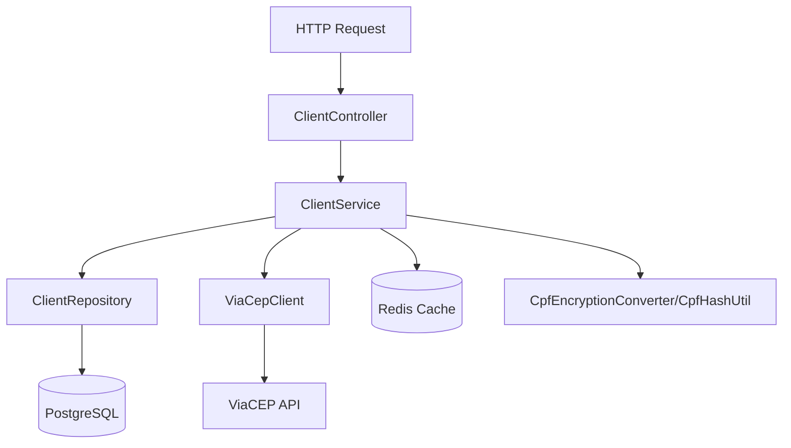
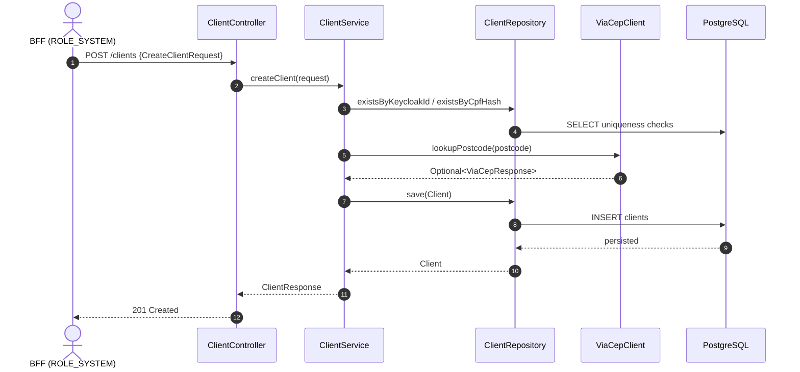
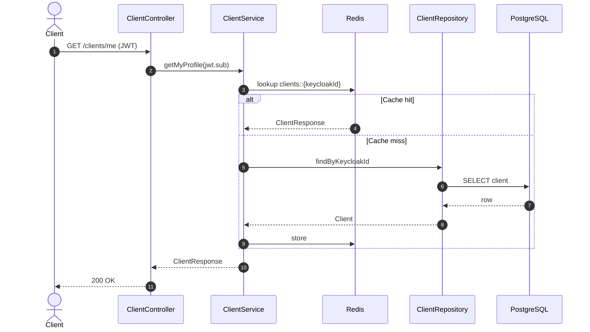
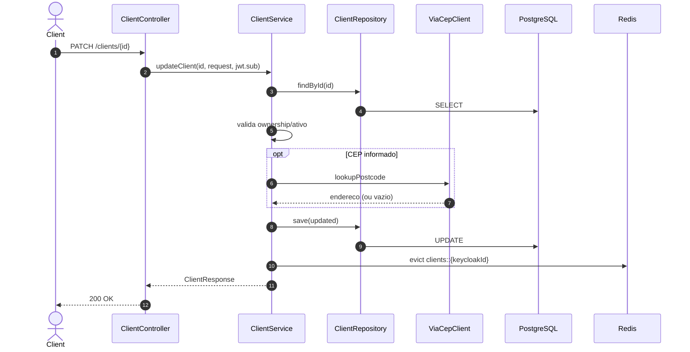
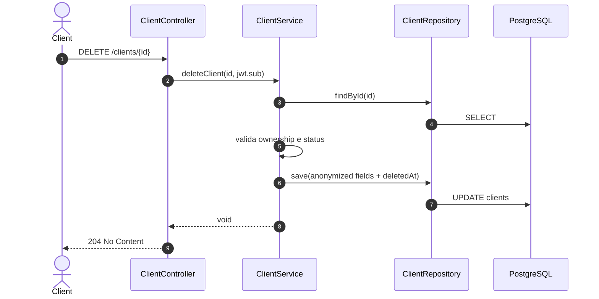
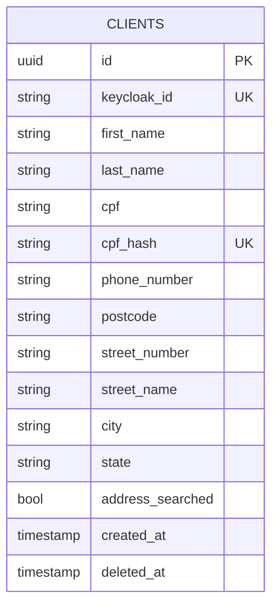

# client-api — Documentacao Tecnica

## 1. Visao Geral
`client-api` e o servico de perfil de clientes do `dealership-ai`: recebe cadastro inicial do cliente (via BFF + token de sistema), disponibiliza consulta/edicao do proprio perfil, permite correcao administrativa de CPF e anonimiza conta, aplicando regras de ownership, criptografia de CPF e enriquecimento de endereco via ViaCEP.

## 2. Stack de Tecnologias

| Tecnologia | Versao | Finalidade |
|------------|--------|------------|
| Java | 25 | Linguagem principal |
| Spring Boot | 4.0.5 | Runtime da API |
| Spring MVC | 4.0.5 (via Boot) | Camada HTTP REST |
| Spring Data JPA | 4.0.5 (via Boot) | Persistencia relacional |
| Spring Security OAuth2 Resource Server | 4.0.5 (via Boot) | JWT + autorizacao por role |
| Spring Cloud OpenFeign | 5.0.x (BOM 2025.1.1) | Cliente HTTP para ViaCEP |
| Spring Data Redis | 4.0.5 (via Boot) | Cache de perfil |
| Flyway | 11.x (via Boot) | Migracoes SQL |
| Resilience4j | 2.3.0 | Circuit breaker no ViaCEP |
| springdoc-openapi | 2.8.8 | OpenAPI/Swagger |
| Caelum Stella Bean Validation | 2.2.2 | Validacao de CPF |
| WireMock | 3.10.0 | Mock de dependencias em teste |
| Instancio | 5.3.0 | Dados sinteticos para testes |
| Rest Assured | 6.0.0 | Testes HTTP |
| Testcontainers | 1.20.4 | Integracao com infraestrutura real |
| Docker | Dockerfile multi-stage | Empacotamento |
| Terraform | >= 1.5.0 (`infra/`) | Provisionamento AWS do servico |

## 3. Estrutura de Diretorios

```text
client-api/
├── src/
│   ├── main/
│   │   ├── java/br/com/dealership/clientapi/
│   │   │   ├── client/                # ViaCepFeignClient e wrapper resiliente
│   │   │   ├── config/                # Security, Redis, OpenAPI, exception handler
│   │   │   ├── controller/            # Endpoint /clients
│   │   │   ├── dto/
│   │   │   │   ├── request/           # Create/Update/CPF requests + validacoes
│   │   │   │   └── response/          # DTOs de retorno + Response<T>
│   │   │   ├── entity/                # Entidade Client e Address embutido
│   │   │   ├── exception/             # Excecoes de dominio e acesso
│   │   │   ├── persistence/           # CpfEncryptionConverter + CpfHashUtil
│   │   │   ├── repository/            # ClientRepository
│   │   │   ├── security/              # Conversor de roles Keycloak
│   │   │   ├── service/               # Regras de negocio de perfil
│   │   │   └── web/                   # Filtro de log de request
│   │   └── resources/
│   │       ├── application.properties
│   │       ├── application-local.yml
│   │       └── db/migration/V1__create_clients_table.sql
│   └── test/
│       ├── java/br/...                # Unit tests
│       └── java/integrated/           # Integration tests
├── infra/                             # Terraform (ECS/ALB/SG/logs/IAM)
├── compose.yaml                       # Redis local
├── Dockerfile
└── pom.xml
```

Arquivos relevantes adicionais:
- `ClientService.java`: ownership, soft-delete/anonymization e cache eviction.
- `CpfEncryptionConverter.java`: criptografia AES/GCM do CPF em repouso.
- `CpfHashUtil.java`: hash HMAC-SHA256 para unicidade de CPF.

## 4. Arquitetura
Padrao principal: **arquitetura em camadas** com controller fino, service concentrando regras de negocio, repository JPA e integracao externa encapsulada (`ViaCepClient`). O modulo segue REST com seguranca JWT, aplica ownership por `sub` do token, usa cache Redis para consulta de perfil e soft-delete por anonimização.

Conceitos-chave:
- **REST + RBAC**: `ROLE_SYSTEM` cria perfil, cliente autenticado consulta/edita o proprio.
- **Security by design**: CPF armazenado criptografado, unicidade por hash.
- **Resilience**: consulta de CEP com circuit breaker e fallback para vazio.
- **Soft delete**: perfil e dados sensiveis anonimizados sem remover linha.

### Diagrama de Arquitetura em Camadas


## 5. Fluxos Principais (Diagramas de Sequencia)

### Fluxo: criar perfil (POST /clients)


### Fluxo: obter proprio perfil (GET /clients/me)


### Fluxo: atualizar perfil (PATCH /clients/{id})


### Fluxo: anonimizar conta (DELETE /clients/{id})


## 6. Modelos de Dados

```text
Entidade: Client
├── id: UUID (PK)
├── keycloakId: String (not null, unique, max 255)
├── firstName: String (not null, max 100)
├── lastName: String (not null, max 100)
├── cpf: String (not null, criptografado por AES/GCM)
├── cpfHash: String (not null, unique, 64 chars)
├── phoneNumber: String (not null, max 20)
├── address: Address (embedded)
│   ├── postcode: String (not null, max 10)
│   ├── streetNumber: String (not null, max 20)
│   ├── streetName: String (max 200)
│   ├── city: String (max 100)
│   ├── state: String (max 2)
│   └── addressSearched: boolean (not null)
├── createdAt: LocalDateTime
└── deletedAt: LocalDateTime (null quando ativo)
```

Validacoes de entrada relevantes:
- CPF valido (`@ValidCpf`) e telefone no formato BR.
- `UpdateClientRequest` exige ao menos um campo.
- Correcao de CPF apenas para `ROLE_ADMIN`.



## 7. Configuracao e Variaveis de Ambiente

| Variavel | Descricao | Obrigatoria | Exemplo |
|----------|-----------|-------------|---------|
| `SERVER_PORT` | Porta HTTP da API | Nao (default) | `8081` |
| `DATASOURCE_URL` | JDBC URL do Postgres | Sim | `jdbc:postgresql://localhost:5432/clientdb` |
| `DATASOURCE_USERNAME` | Usuario do banco | Sim | `client` |
| `DATASOURCE_PASSWORD` | Senha do banco | Sim | `client` |
| `REDIS_HOST` | Host Redis | Nao (default) | `localhost` |
| `REDIS_PORT` | Porta Redis | Nao (default) | `6379` |
| `JWKS_URI` | URL JWKS do IdP | Nao (default) | `https://idp.example.com/realms/dealership/protocol/openid-connect/certs` |
| `CPF_ENCRYPTION_KEY` | Chave base64 AES para criptografia CPF | Sim | `base64-encoded-32-byte-key` |
| `CPF_HMAC_SECRET` | Segredo HMAC para hash de CPF | Sim | `my-hmac-secret` |
| `VIACEP_BASE_URL` | Endpoint base do ViaCEP | Nao (default) | `https://viacep.com.br` |

## 8. Como Executar Localmente

### Pre-requisitos
- Java 25+
- Docker + Docker Compose v2

### Passos
```bash
# 1. Clone o repositorio
git clone https://github.com/Joao-Victorsg/dealership-ai.git
cd dealership-ai/client-api

# 2. Suba dependencias locais (Redis; Postgres externo ou devutils stack)
docker compose up -d

# 3. Defina variaveis obrigatorias (datasource + criptografia CPF)
export DATASOURCE_URL=jdbc:postgresql://localhost:5432/clientdb
export DATASOURCE_USERNAME=client
export DATASOURCE_PASSWORD=client
export CPF_ENCRYPTION_KEY=<base64-key>
export CPF_HMAC_SECRET=<hmac-secret>

# 4. Execute a aplicacao
./mvnw spring-boot:run
```

## 9. Testes

### Testes Unitarios
```bash
./mvnw test
```

### Testes de Integracao
- Escopo: fluxos HTTP com banco/redis reais e cenarios de seguranca.
- Pre-requisitos: Docker ativo.

```bash
./mvnw failsafe:integration-test

# ou suite completa
./mvnw clean verify
```

Relatorio de cobertura: `target/site/jacoco/index.html` (quando habilitado no build).

### Como Adicionar Novos Testes
- Unitarios em `src/test/java/br/com/dealership/clientapi/**` com foco em service/controller.
- Integracao em `src/test/java/integrated/**` com sufixo `*IT`.
- Para cenarios externos, prefira stubs/WireMock em vez de chamadas reais.

## 10. Infraestrutura / IaC
`infra/` provisiona os recursos de deploy da API em AWS: task/service ECS, target group + listener de LB, security group, IAM de execucao e logs CloudWatch, com dependencias vindas de estados remotos (VPC, DB, Redis, parameters/secrets).

```bash
cd infra/
terraform init
terraform plan -var-file="env/dev.tfvars"
terraform apply -var-file="env/dev.tfvars"
```

## 11. Decisoes Tecnicas e Conceitos

| Decisao | Justificativa |
|---------|---------------|
| CPF criptografado + hash separado | Protege dado sensivel e preserva unicidade |
| `deletedAt` + anonimização no delete | Mantem historico sem expor PII |
| Ownership por `keycloakId` no token | Impede acesso cruzado entre clientes |
| ViaCEP com fallback | Evita indisponibilidade total por dependencia externa |
| Cache de perfil por `keycloakId` | Melhora latencia de `/clients/me` |
