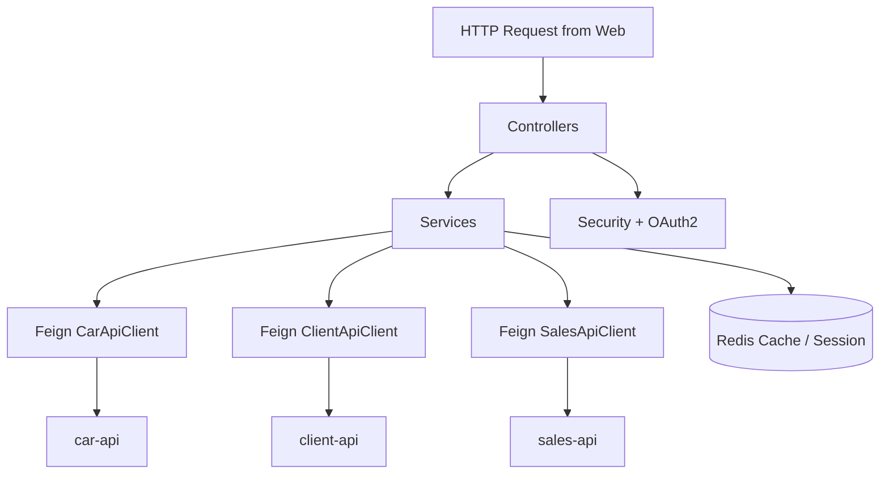
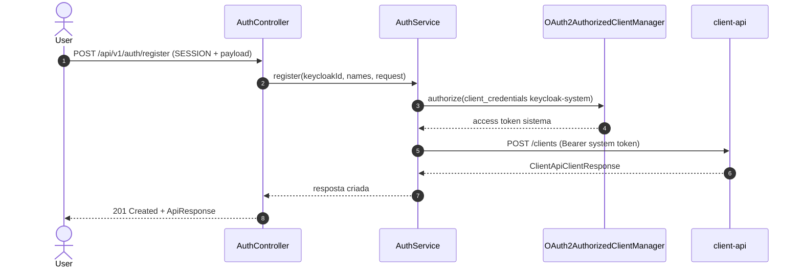
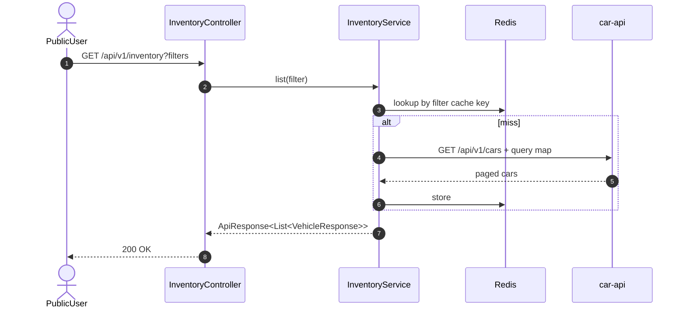
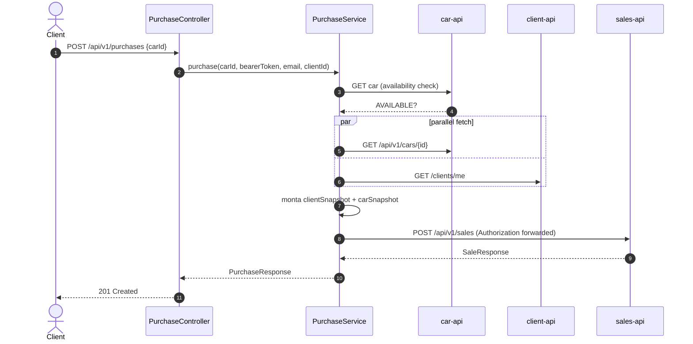
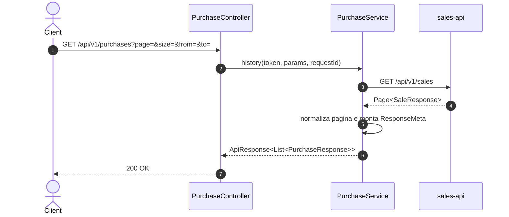
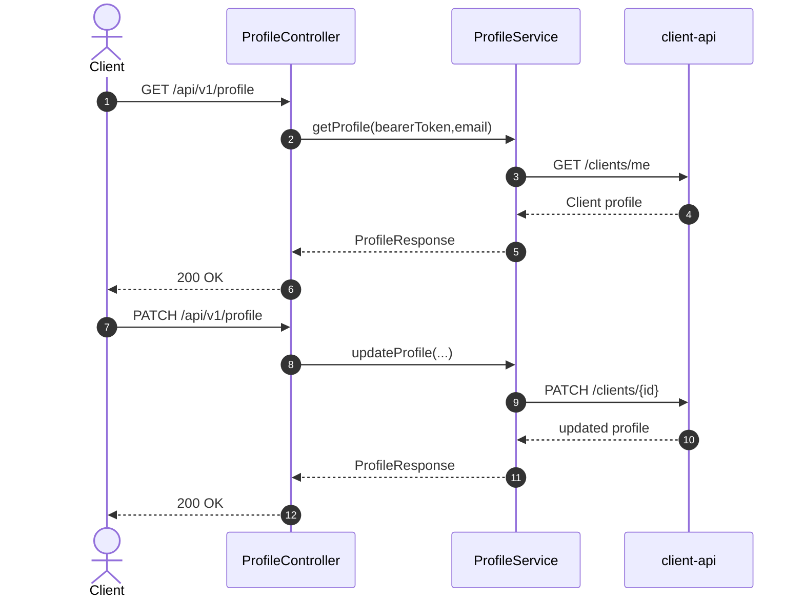
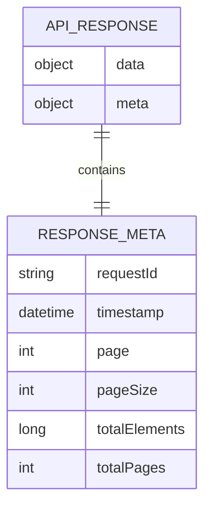

# dealership-bff — Documentacao Tecnica

## 1. Visao Geral
`dealership-bff` e a camada de Backend for Frontend do `dealership-ai`: centraliza autenticacao OIDC/PKCE com Keycloak, mantem sessao em Redis e orquestra chamadas para `car-api`, `client-api` e `sales-api`, expondo contratos estáveis para o frontend (`dealership-web`) com envelope padronizado `ApiResponse<T>`.

## 2. Stack de Tecnologias

| Tecnologia | Versao | Finalidade |
|------------|--------|------------|
| Java | 25 | Linguagem principal |
| Spring Boot | 4.0.6 | Runtime BFF |
| Spring MVC | 4.0.6 (via Boot) | Endpoints REST |
| Spring Security OAuth2 Client | 4.0.6 (via Boot) | Login PKCE + sessao OIDC |
| Spring Security OAuth2 Resource Server | 4.0.6 (via Boot) | JWT bearer inbound |
| Spring Session Data Redis | 4.0.6 (via Boot) | Sessao distribuida (`SESSION`) |
| Spring Data Redis | 4.0.6 (via Boot) | Cache de agregacoes |
| Spring Cloud OpenFeign | 5.0.x (BOM 2025.1.0) | Integracao com APIs downstream |
| Feign OkHttp | 13.x (via dependencia) | Transporte HTTP Feign |
| Resilience4j | 2.3.0 | Circuit breaker/retry/ratelimit/time limit |
| springdoc-openapi | 3.0.2 | OpenAPI/Swagger |
| New Relic API | 9.2.0 | Integracao de observabilidade assíncrona |
| Instancio | 5.3.0 | Dados de teste |
| Rest Assured | 6.0.0 | Testes HTTP |
| WireMock Spring Boot | 3.6.0 | Mocks de integracao |
| JaCoCo | 0.8.13 | Cobertura (gate 90%) |
| PIT | 1.19.1 | Mutation testing |
| Docker | Dockerfile multi-stage | Empacotamento |
| Terraform | >= 1.5.0 (`infra/`) | Provisionamento AWS (ECS + API Gateway HTTP) |

## 3. Estrutura de Diretorios

```text
dealership-bff/
├── src/
│   ├── main/
│   │   ├── java/br/com/dealership/dealershibff/
│   │   │   ├── config/                 # Security, OAuth2 handlers, async, redis, openapi
│   │   │   ├── controller/             # Auth, Inventory, Profile, Purchase
│   │   │   ├── domain/                 # Excecoes de dominio BFF
│   │   │   ├── dto/
│   │   │   │   ├── request/            # Filtros e payloads da borda
│   │   │   │   └── response/           # ApiResponse + modelos de resposta
│   │   │   ├── feign/
│   │   │   │   ├── car/                # Cliente car-api + DTOs
│   │   │   │   ├── client/             # Cliente client-api + DTOs
│   │   │   │   └── sales/              # Cliente sales-api + DTOs
│   │   │   ├── service/                # Orquestracao principal
│   │   │   ├── validation/             # Validadores customizados (ex.: CPF)
│   │   │   └── web/                    # Filtros de request/session token injection
│   │   └── resources/
│   │       ├── application.properties
│   │       ├── application-local.properties
│   │       └── templates/static        # artefatos web auxiliares
│   └── test/
│       ├── java/br/...                 # Unit tests
│       └── java/integrated/            # Integration tests
├── infra/                              # Terraform ECS + API Gateway v2 + VPC link
├── compose.yaml                        # Redis local
├── Dockerfile
└── pom.xml
```

Arquivos relevantes:
- `service/PurchaseService.java`: compra com fetch paralelo e montagem de snapshot.
- `config/SecurityConfig.java`: login OIDC, logout `/api/v1/auth/logout`, roles e session filter.
- `config/AsyncConfig.java`: executor virtual thread com propagacao de MDC/New Relic.

## 4. Arquitetura
Padrao principal: **BFF orchestration layer** com APIs assíncronas (`CompletableFuture`) e integracao resiliente via Feign + Resilience4j. O modulo nao persiste dominio de negocio; sua funcao e autenticar o usuario, consolidar dados de APIs de dominio e entregar contratos frontend-friendly com metadata.

Conceitos-chave:
- **BFF pattern**: frontend fala apenas com este modulo.
- **OIDC PKCE + sessao**: login pelo Keycloak e cookie `SESSION` HttpOnly.
- **Async fan-in**: `PurchaseService` chama car/client em paralelo.
- **Response envelope**: `ApiResponse<T>` com `ResponseMeta` e paginacao.
- **Resilience4j cross-cutting**: cada downstream possui CB/Retry/RL/Timeout/Bulkhead.

### Diagrama de Arquitetura em Camadas


## 5. Fluxos Principais (Diagramas de Sequencia)

### Fluxo: completar registro de negocio (POST /api/v1/auth/register)


### Fluxo: listar inventario (GET /api/v1/inventory)


### Fluxo: compra de veiculo (POST /api/v1/purchases)


### Fluxo: historico de compras (GET /api/v1/purchases)


### Fluxo: obter/atualizar perfil (GET/PATCH /api/v1/profile)


## 6. Modelos de Dados

```text
DTO: PurchaseRequest
└── carId: UUID (not null)

DTO: RegisterRequest
├── firstName/lastName: String (podem vir do token)
├── cpf: String (not blank, validacao CPF)
├── phone: String (regex BR)
├── cep: String (not blank)
└── streetNumber: String (not blank)

DTO: ApiResponse<T>
├── data: T
└── meta: ResponseMeta
    ├── timestamp: Instant
    ├── requestId: String
    ├── page/pageSize/totalElements/totalPages: opcionais

DTO: PurchaseResponse
├── id: UUID
├── registeredAt: Instant
├── status: String
├── vehicle: VehicleSnapshot
└── client: ClientSnapshot
```



## 7. Configuracao e Variaveis de Ambiente

| Variavel | Descricao | Obrigatoria | Exemplo |
|----------|-----------|-------------|---------|
| `SERVER_PORT` | Porta HTTP do BFF | Nao (default) | `8083` |
| `REDIS_HOST` / `REDIS_PORT` | Redis para cache e session | Nao (default) | `localhost` / `6379` |
| `KEYCLOAK_BASE_URL` | Base interna para token/jwks | Nao (default) | `http://localhost:8080` |
| `KEYCLOAK_EXTERNAL_URL` | Base publica para authorization/logout | Nao (default) | `https://auth.localhost:4443` |
| `KEYCLOAK_REALM` | Realm OIDC | Nao (default) | `dealership` |
| `KEYCLOAK_CLIENT_ID` / `KEYCLOAK_CLIENT_SECRET` | Client OAuth2 do BFF | Nao (default) | `dealership-bff` / `dealership-bff-secret` |
| `KEYCLOAK_SYSTEM_CLIENT_ID` / `KEYCLOAK_SYSTEM_CLIENT_SECRET` | Client credentials para chamada sistemica | Nao (default) | `dealership-system` / `dealership-system-secret` |
| `APP_POST_LOGIN_REDIRECT_URI` | Redirect pos login | Nao (default) | `https://app.localhost:4443` |
| `APP_POST_LOGOUT_REDIRECT_URI` | Redirect pos logout | Nao (default) | `https://app.localhost:4443/` |
| `APP_POST_REGISTRATION_REDIRECT_URI` | Redirect pos registro | Nao (default) | `https://app.localhost:4443/complete-registration` |
| `CAR_API_BASE_URL` / `CLIENT_API_BASE_URL` / `SALES_API_BASE_URL` | Endpoints downstream | Nao (default) | `http://localhost:8081`, `http://localhost:8082`, `http://localhost:8083` |
| `CAR_API_CONNECT_TIMEOUT`, `CAR_API_READ_TIMEOUT` | Timeout cliente car-api | Nao (default) | `2000`, `5000` |
| `CLIENT_API_CONNECT_TIMEOUT`, `CLIENT_API_READ_TIMEOUT` | Timeout cliente client-api | Nao (default) | `2000`, `5000` |
| `SALES_API_CONNECT_TIMEOUT`, `SALES_API_READ_TIMEOUT` | Timeout cliente sales-api | Nao (default) | `2000`, `5000` |
| `CAR_API_*`, `CLIENT_API_*`, `SALES_API_*` (CB/Retry/RL/TL/BH) | Tuning Resilience4j por downstream | Nao (defaults no `application.properties`) | `SALES_API_CB_WINDOW_SIZE=10` |
| `SESSION_COOKIE_SECURE`, `SESSION_COOKIE_SAME_SITE` | Politica de cookie da sessao | Nao (default) | `false`, `lax` |

## 8. Como Executar Localmente

### Pre-requisitos
- Java 25+
- Docker + Docker Compose
- Keycloak local (via `devutils/docker-compose.yml`) para fluxo completo de auth

### Passos
```bash
# 1. Clone o repositorio
git clone https://github.com/Joao-Victorsg/dealership-ai.git
cd dealership-ai/dealership-bff

# 2. Suba Redis local
docker compose up -d

# 3. Execute a aplicacao
./mvnw spring-boot:run
```

## 9. Testes

### Testes Unitarios
```bash
./mvnw test
```

### Testes de Integracao
- Escopo: contratos HTTP do BFF, auth/session e orquestracao entre APIs.
- Pre-requisitos: Docker ativo e infraestrutura de suporte para cenarios integrados.

```bash
./mvnw failsafe:integration-test

# suite completa
./mvnw clean verify
```

Relatorios:
- JaCoCo: `target/site/jacoco/index.html`
- PIT: `target/pit-reports/index.html`

### Como Adicionar Novos Testes
- Unitarios em `src/test/java/br/com/dealership/dealershibff/**`.
- Integracao em `src/test/java/integrated/**`.
- Em testes de orquestracao, valide mapping de payload e propagacao de `Authorization`.

## 10. Infraestrutura / IaC
`infra/` provisiona deploy do BFF em ECS e exposicao publica via API Gateway HTTP com VPC Link para o ALB interno, incluindo IAM, log groups e security groups.

```bash
cd infra/
terraform init
terraform plan -var-file="env/dev.tfvars"
terraform apply -var-file="env/dev.tfvars"
```

## 11. Decisoes Tecnicas e Conceitos

| Decisao | Justificativa |
|---------|---------------|
| BFF com sessao Redis + OIDC PKCE | Evita expor tokens no frontend e simplifica auth state |
| Feign + Resilience4j por downstream | Isola degradacao de dependencia e permite tuning por servico |
| `CompletableFuture` com virtual threads | Melhora latencia em orquestracoes paralelas |
| Envelope `ApiResponse<T>` unico | Contrato consistente para UI e observabilidade (`requestId`) |
| Compra com snapshots completos no payload de vendas | Garante independência de enriquecimento posterior no fluxo assíncrono |
