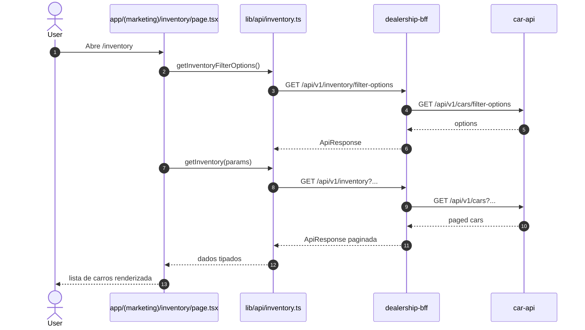
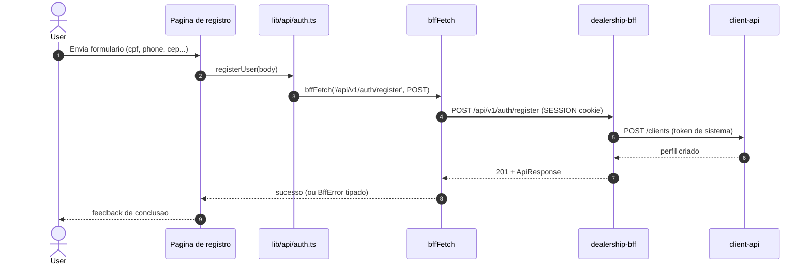
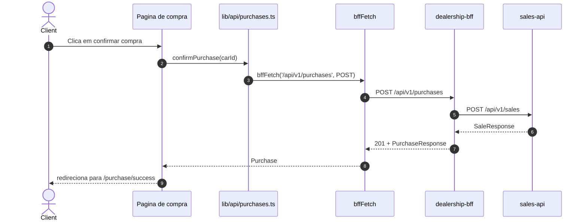
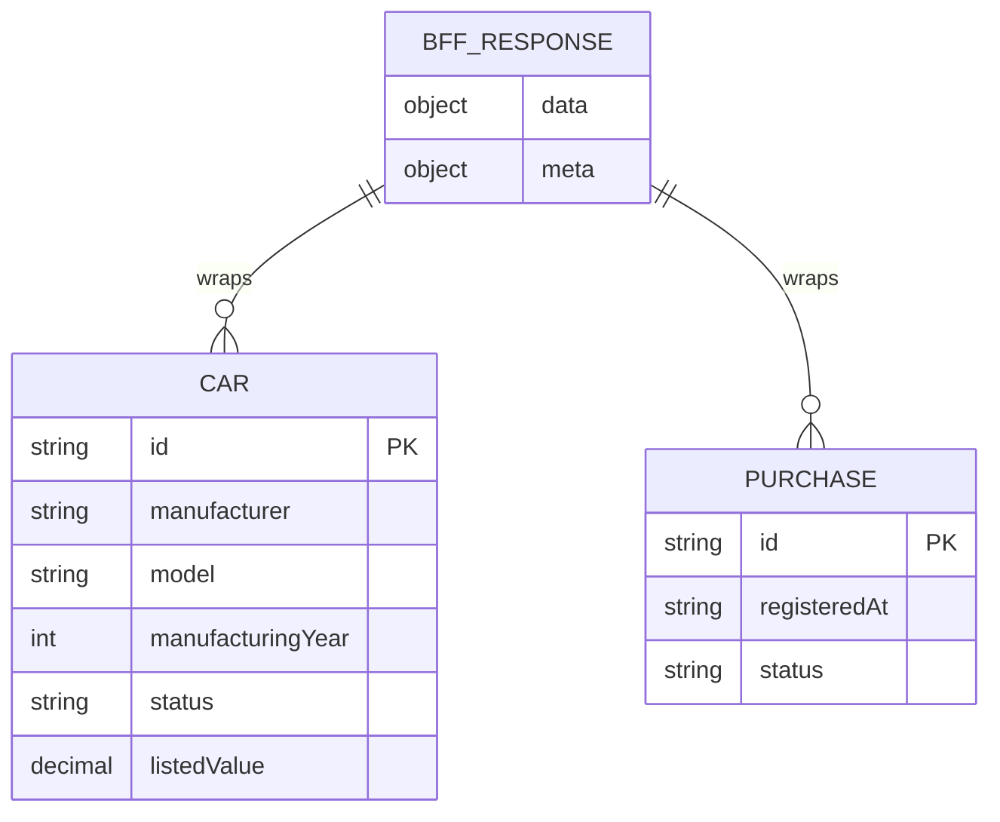

# dealership-web — Documentacao Tecnica

## 1. Visao Geral
`dealership-web` e o frontend oficial do `dealership-ai`, responsavel pela experiencia web de catalogo, conta e compra de veiculos; ele consome exclusivamente o `dealership-bff`, aplicando contratos tipados, tratamento padronizado de erro (`BffError`) e fluxos de autenticacao baseados em sessao.

## 2. Stack de Tecnologias

| Tecnologia | Versao | Finalidade |
|------------|--------|------------|
| Node.js (runtime de build/dev) | 22.x (Docker) | Execucao local e build |
| Next.js | 16.2.4 | Framework web (App Router) |
| React | 19.2.4 | UI componentizada |
| TypeScript | 5.x | Tipagem esttica |
| Tailwind CSS | 4.x | Estilizacao |
| React Hook Form | 7.75.0 | Formularios |
| Zod | 3.25.76 | Validacao de esquema |
| TanStack Query | 5.100.7 | Estado assíncrono/cache client-side |
| Zustand | 4.5.7 | Estado local de UI |
| Vitest | 4.1.5 | Testes unitarios |
| Testing Library | 16.3.2 (`react`) | Testes de componente |
| MSW | 2.14.2 | Mock de API nos testes |
| Playwright | 1.59.1 | E2E |
| @axe-core/playwright | 4.11.3 | Verificacao de acessibilidade em E2E |
| Stryker | 9.6.1 | Mutation testing |
| ESLint | 9.x | Lint |
| Docker | node:22-alpine | Container de build/runtime |
| Terraform | >= 1.5.0 (`infra/`) | Provisionamento AWS do frontend |

## 3. Estrutura de Diretorios

```text
dealership-web/
├── app/
│   ├── (marketing)/                   # Home, about, inventario publico
│   ├── (customer)/                    # Conta, compra, historico
│   ├── (admin)/                       # Paginas administrativas
│   ├── (auth)/                        # Fluxos de autenticacao/registro
│   ├── actions/                       # Server Actions (ex.: logout)
│   ├── register/                      # Fluxo de cadastro complementar
│   ├── layout.tsx                     # Layout raiz
│   └── globals.css                    # Estilos globais
├── components/                        # Componentes de UI por dominio
├── lib/
│   ├── api/                           # Cliente tipado do BFF e contratos TS
│   ├── errors.ts                      # Normalizacao de erros para UI
│   ├── format.ts                      # Formatadores monetarios/data
│   ├── pricing.ts                     # Regras de exibicao de preco
│   ├── stores/                        # Estado local (Zustand)
│   └── utils/                         # Utilitarios
├── e2e/                               # Testes E2E Playwright
├── tests/
│   ├── unit/                          # Unit/component tests (Vitest)
│   └── setup.ts                       # Setup global de testes
├── infra/                             # Terraform ECS/LB para frontend
├── public/                            # Assets estaticos
├── next.config.ts                     # CSP, remote images, headers de seguranca
├── package.json                       # Scripts/dependencias
├── playwright.config.ts               # Config E2E
├── vitest.config.ts                   # Config unit tests + cobertura
└── .env.local.example                 # Variaveis locais
```

Arquivos relevantes:
- `lib/api/client.ts`: wrapper `bffFetch` com forwarding de cookie e erro tipado.
- `lib/api/types.ts`: fonte de verdade dos contratos frontend-BFF.
- `app/(marketing)/inventory/page.tsx`: pagina principal de busca/filtro de carros.

## 4. Arquitetura
Padrao principal: **frontend por features com App Router (Next.js)**, separando rotas por dominio (`marketing`, `customer`, `admin`, `auth`) e centralizando acesso HTTP em `lib/api/*`. O frontend nao acessa banco diretamente; toda persistencia passa pelo BFF com cookies de sessao.

Conceitos-chave:
- **BFF-only integration**: nenhuma chamada direta para APIs de dominio.
- **Typed API client**: contratos TS e erro padronizado (`BffError`).
- **Server + Client Components**: renderizacao hibrida do App Router.
- **Security headers/CSP**: definidos em `next.config.ts`.

### Diagrama de Arquitetura em Camadas
```mermaid
graph TD
    A[Browser] --> B[Next.js App Router]
    B --> C[Server Actions / Route Handlers]
    B --> D[Client Components]
    C --> E[lib/api/client.ts (bffFetch)]
    D --> E
    E --> F[dealership-bff]
    F --> G[car-api/client-api/sales-api]
```

## 5. Fluxos Principais (Diagramas de Sequencia)

### Fluxo: navegar inventario (GET /inventory)


### Fluxo: completar registro (POST /api/v1/auth/register)


### Fluxo: confirmar compra (POST /api/v1/purchases)


## 6. Modelos de Dados

```text
Modelo: Car (frontend contract)
├── id: string (UUID)
├── model/manufacturer: string
├── manufacturingYear: number
├── status: "AVAILABLE" | "SOLD" | "UNAVAILABLE"
├── category/type/propulsionType: string literal unions
├── listedValue: number
├── imageKey: string | null
└── optionalItems: string[]

Modelo: CustomerProfile
├── id: string
├── firstName/lastName/cpf/email/phone
├── createdAt: ISO datetime
└── address: CustomerAddress

Modelo: Purchase
├── id: string
├── registeredAt: string
├── status: "COMPLETED"
├── vehicle: PurchaseVehicleSnapshot
└── client: PurchaseClientSnapshot

Envelope: BffResponse<T>
├── data: T
└── meta: { requestId, timestamp, ...paginacao }
```



## 7. Configuracao e Variaveis de Ambiente

| Variavel | Descricao | Obrigatoria | Exemplo |
|----------|-----------|-------------|---------|
| `BFF_URL` | URL privada do BFF para Server Components/Actions | Sim | `http://localhost:8083` |
| `NEXT_PUBLIC_BFF_URL` | URL publica do BFF para browser | Sim | `https://app.localhost:4443` |
| `NEXT_PUBLIC_CDN_URL` | Base para imagens (CDN ou proxy local) | Sim | `https://app.localhost:4443/static` |
| `NEXT_PUBLIC_APP_URL` | URL base da aplicacao web | Sim | `https://app.localhost:4443` |
| `NEXT_PUBLIC_KEYCLOAK_URL` | URL publica do Keycloak | Sim | `https://auth.localhost:4443` |
| `NODE_ENV` | Ambiente de execucao | Nao (gerenciado pelo runtime) | `development` |

## 8. Como Executar Localmente

### Pre-requisitos
- Node.js 22+
- npm 10+
- BFF e dependencias de backend rodando

### Passos
```bash
# 1. Clone o repositorio
git clone https://github.com/Joao-Victorsg/dealership-ai.git
cd dealership-ai/dealership-web

# 2. Configure variaveis locais
cp .env.local.example .env.local

# 3. Instale dependencias
npm ci

# 4. Execute o frontend
npm run dev
```

## 9. Testes

### Testes Unitarios
```bash
npm run test
npm run test:coverage
```

### Testes de Integracao
- O modulo usa E2E com Playwright como teste de integracao da interface + BFF mock.
- Pre-requisitos: dependencias instaladas.

```bash
npm run e2e
```

Relatorios:
- Vitest coverage: `coverage/` (quando executado com `test:coverage`)
- Playwright HTML: `playwright-report/`

### Como Adicionar Novos Testes
- Unit/component tests em `tests/unit/**` usando Vitest + Testing Library.
- E2E specs em `e2e/**` com Playwright.
- Mantenha fixtures/mocks alinhados aos contratos em `lib/api/types.ts`.

## 10. Infraestrutura / IaC
`infra/` provisiona o frontend em ECS (task/service), target group/listener e recursos de rede/log para exposicao na infraestrutura AWS do projeto.

```bash
cd infra/
terraform init
terraform plan -var-file="env/dev.tfvars"
terraform apply -var-file="env/dev.tfvars"
```

## 11. Decisoes Tecnicas e Conceitos

| Decisao | Justificativa |
|---------|---------------|
| Frontend chama apenas BFF | Reduz acoplamento e centraliza seguranca/contratos |
| `bffFetch` como unico cliente HTTP | Padroniza erro, headers e forwarding de cookie |
| Contratos TS centralizados em `lib/api/types.ts` | Evita divergencia entre paginas/componentes |
| App Router por dominios (`marketing/customer/admin/auth`) | Escalabilidade de navegacao e ownership de features |
| E2E com mock BFF dedicado | Testes deterministas sem depender de backend real |
