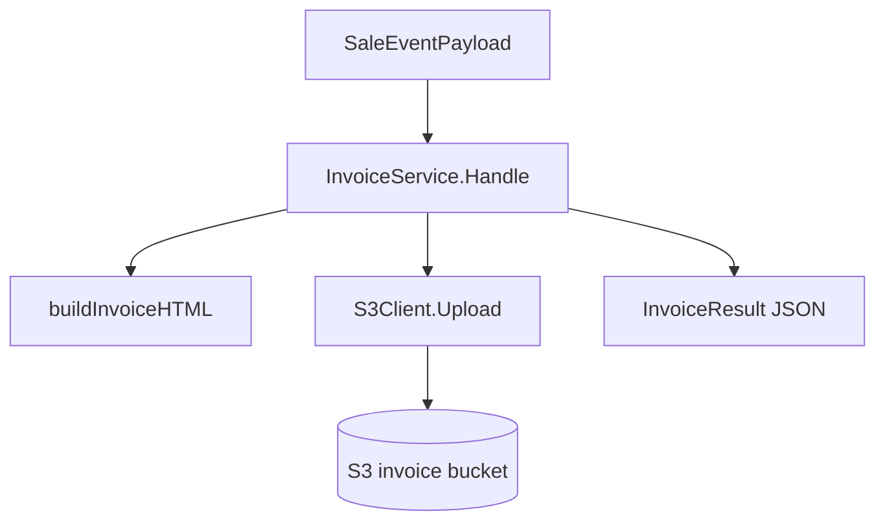
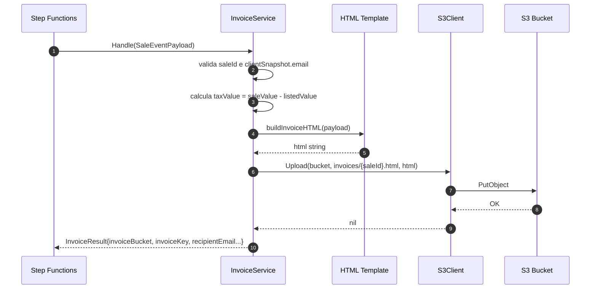
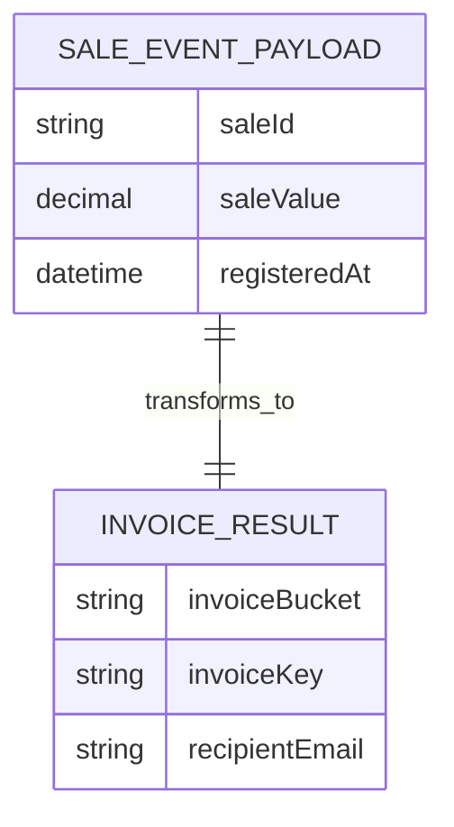

# lambda-invoice-processor — Documentacao Tecnica

## 1. Visao Geral
`lambda-invoice-processor` recebe o `SaleEventPayload`, gera um HTML de invoice com dados de cliente/veiculo/valores e grava o artefato no S3, retornando metadados consumidos pelo proximo passo do workflow (`lambda-send-email`).

## 2. Stack de Tecnologias

| Tecnologia | Versao | Finalidade |
|------------|--------|------------|
| Go | 1.25 | Linguagem principal |
| AWS Lambda Go SDK | 1.54.0 | Runtime Lambda |
| AWS SDK for Go v2 (core) | 1.41.7 | Cliente AWS base |
| AWS SDK v2 config | 1.32.17 | Configuracao AWS |
| AWS SDK v2 S3 | 1.91.1 | Upload do HTML da invoice |
| shopspring/decimal | 1.4.0 | Calculo monetario preciso |
| Terraform | >= 1.5.0 (`infra/`) | Provisionamento da lambda |

## 3. Estrutura de Diretorios

```text
lambda-invoice-processor/
├── cmd/lambda/main.go                 # Bootstrap da lambda
├── internal/
│   ├── client/s3_client.go            # PutObject wrapper
│   ├── config/config.go               # Leitura de INVOICE_BUCKET_NAME
│   └── service/
│       ├── invoice_service.go         # Regras de geracao de invoice
│       └── models.go                  # Modelos de entrada/saida
├── tests/
│   ├── contract/                      # Contrato de saida do processor
│   └── fixtures/                      # Payloads de entrada
├── infra/                             # Terraform (lambda, iam, logs)
├── go.mod
└── README.md
```

## 4. Arquitetura
Padrao principal: **Lambda stateless de transformacao de payload**. O handler (metodo `Handle` no service) valida campos minimos, transforma o evento em view-model HTML e persiste o arquivo no S3. O resultado e um objeto estruturado contendo bucket/key/url para encadear o envio de e-mail.

Conceitos-chave:
- **Step Functions task worker**: executada como etapa intermediaria do workflow.
- **Contract-first output**: retorno padronizado para etapa seguinte.
- **Calculo monetario deterministico**: decimal para evitar erro de ponto flutuante.

### Diagrama de Arquitetura em Camadas


## 5. Fluxos Principais (Diagramas de Sequencia)

### Fluxo principal: gerar e persistir invoice HTML


## 6. Modelos de Dados

```text
Entrada: SaleEventPayload
├── saleId: string
├── carId: string
├── clientId: string
├── saleValue: decimal
├── registeredAt: time.Time
├── clientSnapshot: ClientSnapshot
│   ├── firstName, lastName, cpf, email
│   └── address: AddressSnapshot
└── carSnapshot: CarSnapshot
    ├── model, manufacturer, colors, year
    ├── type, category, vin, status
    └── listedValue: decimal

Saida: InvoiceResult
├── saleId
├── invoiceBucket
├── invoiceKey
├── invoiceUrl
├── recipientEmail
├── subject
├── registeredAt
├── saleValue
├── listedValue
└── taxValue
```



## 7. Configuracao e Variaveis de Ambiente

| Variavel | Descricao | Obrigatoria | Exemplo |
|----------|-----------|-------------|---------|
| `INVOICE_BUCKET_NAME` | Bucket destino para invoices HTML | Sim | `invoice-bucket` |

## 8. Como Executar Localmente

### Pre-requisitos
- Go 1.25+
- Acesso a S3/LocalStack configurado no ambiente

### Passos
```bash
# 1. Clone o repositorio
git clone https://github.com/Joao-Victorsg/dealership-ai.git
cd dealership-ai/lambda-invoice-processor

# 2. Build do bootstrap
GOOS=linux GOARCH=arm64 CGO_ENABLED=0 go build -o bootstrap ./cmd/lambda

# 3. Executar testes
go test ./...
```

## 9. Testes

### Testes Unitarios
```bash
go test ./...
```

### Testes de Integracao
> N/A — nao aplicavel a este modulo.

### Como Adicionar Novos Testes
- Unit tests por pacote em `internal/**`.
- Contratos de entrada/saida em `tests/contract`.
- Inclua fixtures representativas em `tests/fixtures` para cenarios de borda.

## 10. Infraestrutura / IaC
`infra/` provisiona Lambda, IAM role/policy, log group e variavel de ambiente (`INVOICE_BUCKET_NAME`) via estado remoto do modulo `infra-s3`.

```bash
cd infra/
terraform init
terraform plan
terraform apply
```

## 11. Decisoes Tecnicas e Conceitos

| Decisao | Justificativa |
|---------|---------------|
| Gerar HTML na lambda em vez de template externo | Mantem artefato autocontido e simplifica deploy |
| Persistir invoice no S3 antes de enviar e-mail | Desacopla geracao e envio, facilitando retry por etapa |
| Retornar valores formatados (`StringFixed(2)`) | Contrato estavel para prox etapa e logs |
| Validar `saleId` e `recipientEmail` como obrigatorios | Evita produzir invoice sem roteamento de notificacao |
