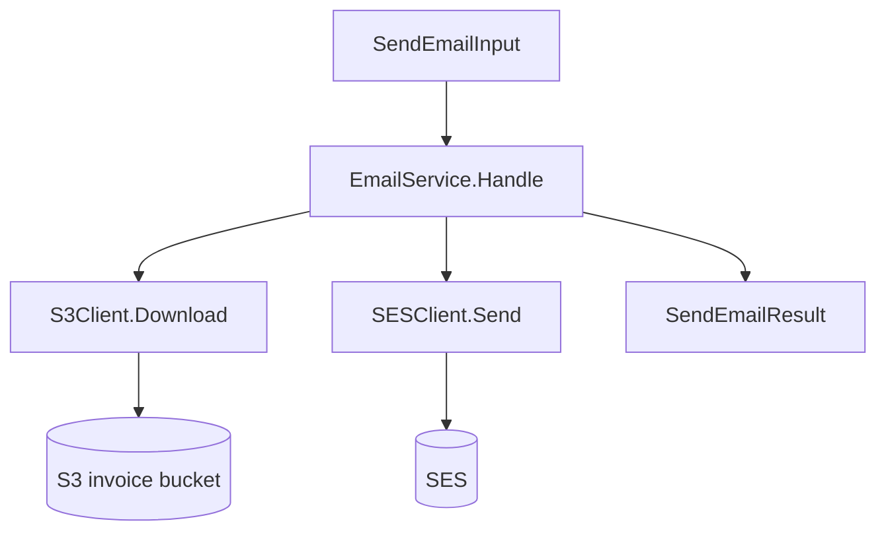
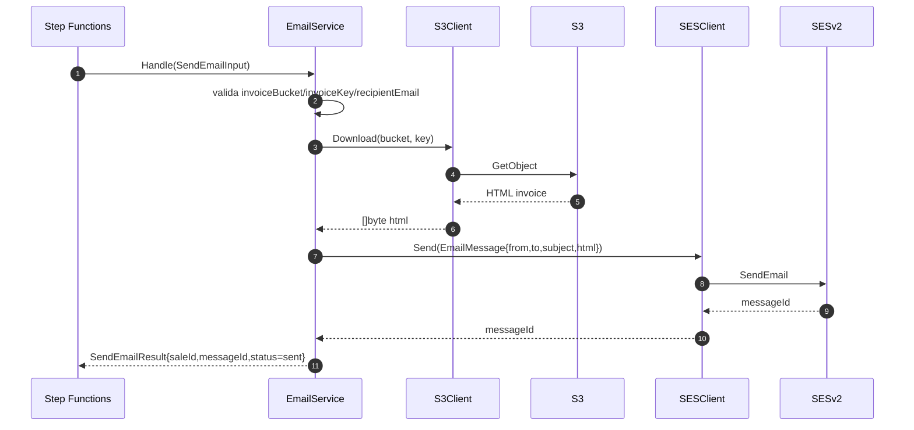
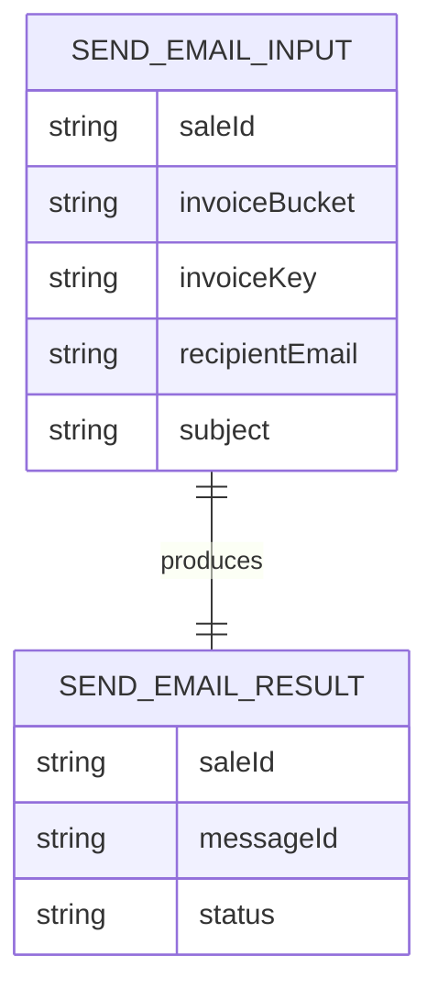

# lambda-send-email — Documentacao Tecnica

## 1. Visao Geral
`lambda-send-email` e a etapa final do workflow de faturamento: recebe metadados da invoice, baixa o HTML no S3 e envia e-mail via SES para o cliente, retornando `messageId` para rastreabilidade.

## 2. Stack de Tecnologias

| Tecnologia | Versao | Finalidade |
|------------|--------|------------|
| Go | 1.25 | Linguagem principal |
| AWS Lambda Go SDK | 1.54.0 | Runtime Lambda |
| AWS SDK for Go v2 (core) | 1.41.7 | Cliente AWS base |
| AWS SDK v2 config | 1.32.17 | Configuracao AWS |
| AWS SDK v2 S3 | 1.91.1 | Download da invoice |
| AWS SDK v2 SESv2 | 1.61.0 | Envio de e-mail |
| Terraform | >= 1.5.0 (`infra/`) | Provisionamento da lambda |

## 3. Estrutura de Diretorios

```text
lambda-send-email/
├── cmd/lambda/main.go                 # Bootstrap da lambda
├── internal/
│   ├── client/
│   │   ├── s3_client.go              # Download do HTML da invoice
│   │   └── ses_client.go             # Envio de mensagem via SESv2
│   ├── config/config.go              # Leitura de EMAIL_FROM
│   └── service/
│       ├── email_service.go          # Regra principal de envio
│       └── models.go                 # Input/Output contracts
├── tests/
│   ├── contract/                      # Contrato de leitura/envio
│   └── fixtures/                      # Payloads de teste
├── infra/                             # Terraform (lambda, iam, logs)
├── go.mod
└── README.md
```

## 4. Arquitetura
Padrao principal: **lambda de envio orientada a mensagem**. O `EmailService` valida o payload de entrada, delega leitura de conteudo para `S3Client` e envio para `SESClient`. Falhas de leitura/envio retornam erro para que a Step Function aplique retry da task.

Conceitos-chave:
- **Step Functions worker** (task terminal de notificacao).
- **Separation of concerns**: leitura (S3) e envio (SES) em clients independentes.
- **Contract output**: retorno padronizado `{saleId, messageId, status}`.

### Diagrama de Arquitetura em Camadas


## 5. Fluxos Principais (Diagramas de Sequencia)

### Fluxo principal: enviar invoice por e-mail


## 6. Modelos de Dados

```text
Entrada: SendEmailInput
├── saleId: string
├── invoiceBucket: string (obrigatorio)
├── invoiceKey: string (obrigatorio)
├── recipientEmail: string (obrigatorio)
└── subject: string (opcional)

Saida: SendEmailResult
├── saleId: string
├── messageId: string
└── status: "sent"

Modelo interno: EmailMessage
├── from
├── to
├── subject
└── htmlBody
```



## 7. Configuracao e Variaveis de Ambiente

| Variavel | Descricao | Obrigatoria | Exemplo |
|----------|-----------|-------------|---------|
| `EMAIL_FROM` | Endereco remetente SES | Nao (default) | `noreply@example.com` |

## 8. Como Executar Localmente

### Pre-requisitos
- Go 1.25+
- Credenciais AWS/LocalStack para S3 + SES

### Passos
```bash
# 1. Clone o repositorio
git clone https://github.com/Joao-Victorsg/dealership-ai.git
cd dealership-ai/lambda-send-email

# 2. Build do bootstrap
GOOS=linux GOARCH=arm64 CGO_ENABLED=0 go build -o bootstrap ./cmd/lambda

# 3. Executar testes
go test ./...
```

## 9. Testes

### Testes Unitarios
```bash
go test ./...
```

### Testes de Integracao
> N/A — nao aplicavel a este modulo.

### Como Adicionar Novos Testes
- Unitarios em `internal/**` para regras de validacao e adapters.
- Contratos em `tests/contract` validando shape de input/output.
- Use fixtures em `tests/fixtures` para manter cenarios repetiveis.

## 10. Infraestrutura / IaC
`infra/` provisiona Lambda, IAM role/policy com permissoes de `s3:GetObject` e `ses:SendEmail`, log group CloudWatch e variavel `EMAIL_FROM` oriunda de estado remoto (`infra-ses`).

```bash
cd infra/
terraform init
terraform plan
terraform apply
```

## 11. Decisoes Tecnicas e Conceitos

| Decisao | Justificativa |
|---------|---------------|
| Ler HTML do S3 antes do envio | Mantem desacoplamento entre geracao e notificacao |
| Subject com fallback por `saleId` | Garante assunto consistente mesmo sem valor no payload |
| Validacao explicita de campos obrigatorios | Falha rapida para contratos invalidos |
| Uso de SESv2 | API atual de envio com retorno de `messageId` para auditoria |
