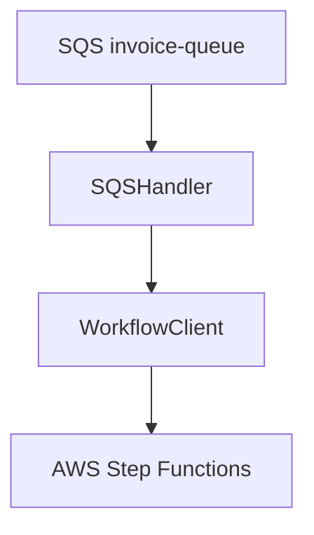
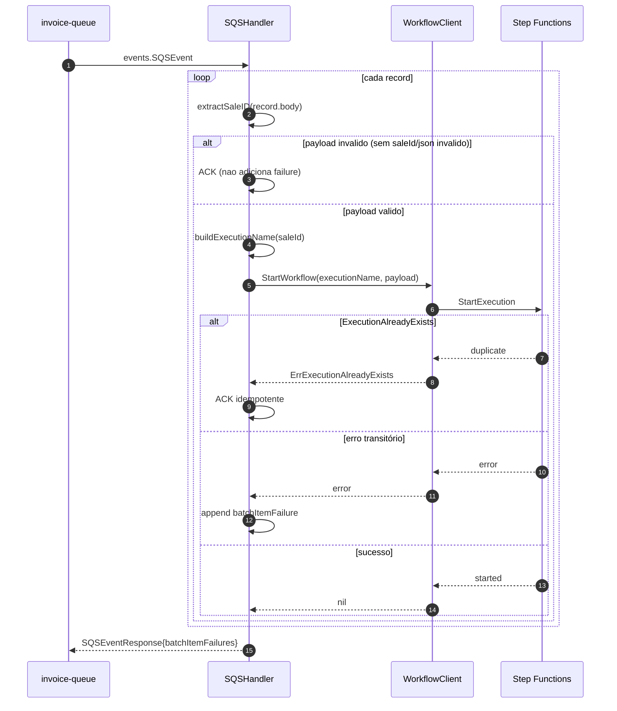
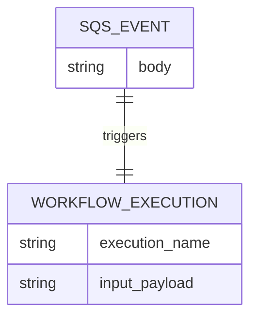

# lambda-start-invoice-workflow — Documentacao Tecnica

## 1. Visao Geral
`lambda-start-invoice-workflow` consome mensagens da `invoice-queue` (originadas do evento de venda) e inicia a execucao da Step Function `invoice-workflow`, garantindo idempotencia por `saleId` e controlando retry por mensagem via `batchItemFailures`.

## 2. Stack de Tecnologias

| Tecnologia | Versao | Finalidade |
|------------|--------|------------|
| Go | 1.25 | Linguagem principal |
| AWS Lambda Go SDK | 1.54.0 | Handler Lambda + eventos SQS |
| AWS SDK for Go v2 (core) | 1.41.7 | Cliente AWS base |
| AWS SDK v2 config | 1.32.17 | Configuracao do SDK |
| AWS SDK v2 SFN | 1.41.0 | StartExecution no Step Functions |
| Terraform | >= 1.5.0 (`infra/`) | Provisionamento da lambda e trigger |

## 3. Estrutura de Diretorios

```text
lambda-start-invoice-workflow/
├── cmd/lambda/main.go                 # Bootstrap da lambda
├── internal/
│   ├── client/stepfunctions_client.go # Wrapper StartExecution + erro idempotente
│   ├── config/config.go               # Leitura de STATE_MACHINE_ARN
│   └── handler/sqs_handler.go         # Parse do evento + batchItemFailures
├── tests/
│   ├── contract/                      # Contrato de payload/execution name
│   └── fixtures/                      # Eventos SQS de exemplo
├── infra/                             # Terraform (lambda, iam, event source mapping)
├── go.mod
└── README.md
```

## 4. Arquitetura
Padrao principal: **lambda orientada a evento SQS**. O handler valida `saleId` de cada mensagem, gera um `executionName` sanitizado e delega o start do workflow para `WorkflowClient`. Erros de payload sao ACK (nao reprocessa), erro de start retorna retry, e `ExecutionAlreadyExists` e tratado como sucesso idempotente.

Conceitos-chave:
- **Event-driven** (SQS -> Lambda).
- **Idempotencia por nome de execucao** (baseado em `saleId`).
- **Retry parcial de lote** com `batchItemFailures`.

### Diagrama de Arquitetura em Camadas


## 5. Fluxos Principais (Diagramas de Sequencia)

### Fluxo principal: iniciar Step Function por mensagem de venda


## 6. Modelos de Dados

```text
Entrada Lambda: events.SQSEvent
└── Records[].Body: string JSON (SaleEventPayload)

Identificador interno: saleEventIdentifier
├── saleId: string (preferencial)
└── SaleId: string (fallback legado)

Saida Lambda: events.SQSEventResponse
└── batchItemFailures[]: MessageId com retry
```



## 7. Configuracao e Variaveis de Ambiente

| Variavel | Descricao | Obrigatoria | Exemplo |
|----------|-----------|-------------|---------|
| `STATE_MACHINE_ARN` | ARN da state machine de invoice | Sim | `arn:aws:states:us-east-1:000000000000:stateMachine:invoice-workflow` |

## 8. Como Executar Localmente

### Pre-requisitos
- Go 1.25+
- Terraform 1.5+ (para `infra/`)
- LocalStack (via `devutils/docker-compose.yml`)

### Passos
```bash
# 1. Clone o repositorio
git clone https://github.com/Joao-Victorsg/dealership-ai.git
cd dealership-ai/lambda-start-invoice-workflow

# 2. Build do artefato Lambda
GOOS=linux GOARCH=arm64 CGO_ENABLED=0 go build -o bootstrap ./cmd/lambda

# 3. Executar testes
go test ./...

# 4. (Opcional) Aplicar infraestrutura local
cd infra
terraform init
terraform apply
```

## 9. Testes

### Testes Unitarios
```bash
go test ./...
```

### Testes de Integracao
> N/A — nao aplicavel a este modulo.

### Como Adicionar Novos Testes
- Testes de handler/client em `internal/**` com `*_test.go`.
- Contratos em `tests/contract` usando fixtures em `tests/fixtures`.
- Para novos cenarios, valide explicitamente semantica de ACK/retry/idempotencia.

## 10. Infraestrutura / IaC
`infra/` provisiona:
- Lambda `start-invoice-workflow`
- IAM role/policy para `states:StartExecution`
- Event source mapping da `invoice-queue`
- Log group CloudWatch

```bash
cd infra/
terraform init
terraform plan
terraform apply
```

## 11. Decisoes Tecnicas e Conceitos

| Decisao | Justificativa |
|---------|---------------|
| `saleId` como execution name | Garante idempotencia natural no Step Functions |
| `ExecutionAlreadyExists` tratado como sucesso | Evita reprocessar evento ja convertido em workflow |
| Payload invalido com ACK | Evita loop de retry para erro permanente de contrato |
| Retry apenas em erro de start execution | Mantem fila resiliente sem duplicar workflows validos |
