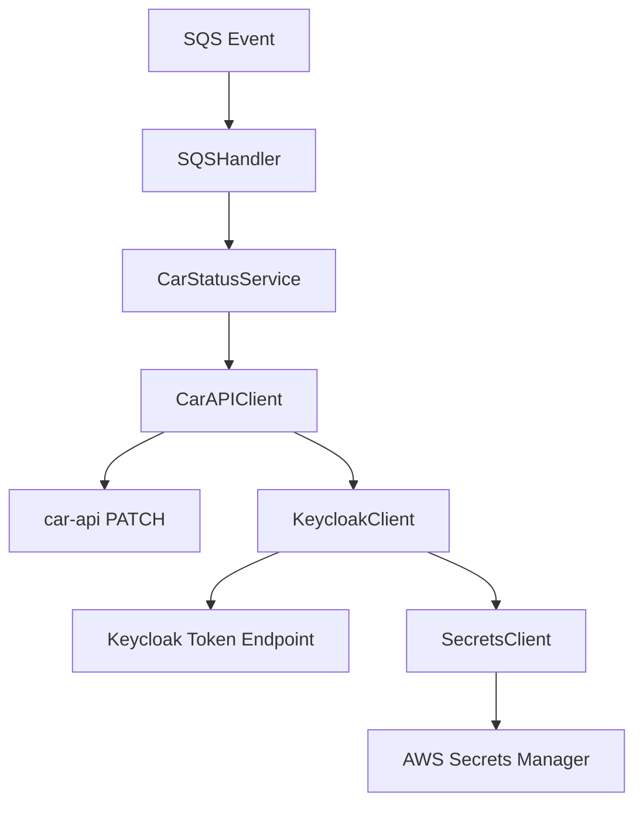
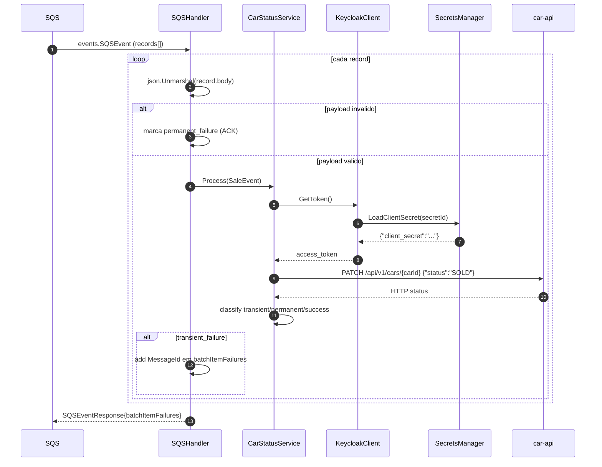
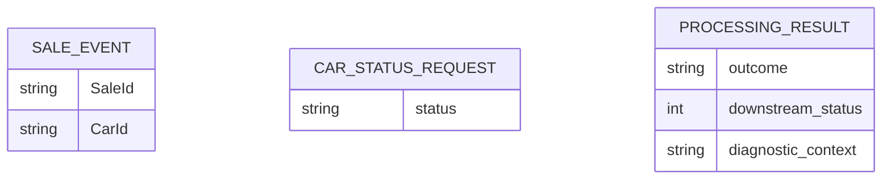

# lambda-update-car-status — Documentacao Tecnica

## 1. Visao Geral
`lambda-update-car-status` consome eventos de venda da fila SQS (`car-status-queue`) e atualiza o status do carro para `SOLD` no `car-api`, com classificacao de erro (transiente/permanente), suporte a reprocessamento seletivo via `batchItemFailures`, token Keycloak por client credentials e circuit breaker para proteger chamadas downstream.

## 2. Stack de Tecnologias

| Tecnologia | Versao | Finalidade |
|------------|--------|------------|
| Go | 1.25 | Linguagem principal |
| AWS Lambda Go SDK | 1.54.0 | Runtime/event model Lambda |
| AWS SDK for Go v2 (core) | 1.41.7 | Cliente AWS base |
| AWS SDK v2 config | 1.32.17 | Carregamento de credenciais/config AWS |
| AWS SDK v2 secretsmanager | 1.41.7 | Leitura de segredo Keycloak |
| sony/gobreaker | 2.4.0 | Circuit breaker para car-api |
| golangci-lint | latest (workflow) | Qualidade estatica |
| go test -race | builtin | Detecao de data race |
| Docker/LocalStack | 4.14.0 (devutils) | Ambiente local de integracao |
| Terraform | >= 1.5.0 (`infra/localstack`) | Provisionamento local da Lambda e fila |

## 3. Estrutura de Diretorios

```text
lambda-update-car-status/
├── cmd/lambda/
│   └── main.go                         # Bootstrap: config, aws sdk, clients e handler
├── internal/
│   ├── client/
│   │   ├── car_api_client.go          # PATCH /api/v1/cars/{carId}
│   │   ├── keycloak_client.go         # Token client_credentials
│   │   └── secrets_client.go          # Le segredo client_secret no Secrets Manager
│   ├── config/config.go               # Carrega e valida env vars
│   ├── handler/sqs_handler.go         # Processa batch SQS e monta batch failures
│   ├── observability/logger.go        # Logger JSON padronizado
│   └── service/
│       ├── car_status_service.go      # Regra de classificacao de resultado
│       ├── errors.go                  # Tipos transient/permanent
│       └── models.go                  # SaleEvent e ProcessingResult
├── tests/
│   ├── contract/                      # Contratos HTTP/evento
│   ├── integration/                   # Cenarios ponta a ponta do handler/service
│   └── fixtures/                      # Payloads de teste
├── infra/localstack/                  # Terraform da lambda, fila, role, logs, secret
├── .golangci.yml
├── go.mod
└── bootstrap                          # Artefato de deploy
```

## 4. Arquitetura
Padrao principal: **Lambda orientada a eventos SQS** com pipeline `handler -> service -> client`. O handler desserializa cada mensagem, o service valida campos obrigatorios e chama o client HTTP do `car-api`. Erros sao classificados em transientes/permanentes; apenas transientes entram em `batchItemFailures` para retry automatico pelo SQS.

Conceitos-chave:
- **Event-driven**: entrada `events.SQSEvent`.
- **Retry parcial por lote**: somente mensagens transientes retornam para reprocessamento.
- **Client credentials**: token Keycloak com segredo em Secrets Manager.
- **Resilience**: circuit breaker + classificacao de HTTP status.

### Diagrama de Arquitetura em Camadas


## 5. Fluxos Principais (Diagramas de Sequencia)

### Fluxo principal: processar lote SQS e atualizar status para SOLD


## 6. Modelos de Dados

```text
Evento de entrada: SaleEvent
├── SaleID: string (json "SaleId", obrigatorio)
└── CarID: string (json "CarId", obrigatorio)

Payload para car-api: CarStatusRequest
└── status: "SOLD"

Resultado interno: ProcessingResult
├── SaleID: string
├── CarID: string
├── Outcome: success | transient_failure | permanent_failure
├── DownstreamStatus: int
└── DiagnosticContext: string
```



## 7. Configuracao e Variaveis de Ambiente

| Variavel | Descricao | Obrigatoria | Exemplo |
|----------|-----------|-------------|---------|
| `CAR_API_BASE_URL` | Base URL do `car-api` | Sim | `http://host.docker.internal:8080` |
| `CAR_API_TIMEOUT_MS` | Timeout HTTP para `car-api` | Sim | `2000` |
| `KEYCLOAK_TOKEN_URL` | Endpoint de token OIDC | Sim | `http://keycloak:8080/realms/dealership/protocol/openid-connect/token` |
| `KEYCLOAK_CLIENT_ID` | Client ID do service account | Sim | `lambda-update-car-status` |
| `KEYCLOAK_SECRET_ID` | SecretId no Secrets Manager | Sim | `local-lambda-update-car-status-secret-01` |
| `KEYCLOAK_REFRESH_SKEW_SECONDS` | Margem para renovar token antes de expirar | Sim | `30` |
| `BREAKER_MAX_REQUESTS` | Max requests em half-open | Sim | `3` |
| `BREAKER_INTERVAL_MS` | Janela de reset do breaker | Sim | `10000` |
| `BREAKER_TIMEOUT_MS` | Tempo em open state | Sim | `5000` |
| `BREAKER_READY_TO_TRIP_FAILURES` | Falhas consecutivas para abrir breaker | Sim | `5` |
| `LOG_LEVEL` | Nivel de log | Sim | `info` |
| `NEW_RELIC_LAMBDA_HANDLER` | Handler quando extension New Relic ativa | Nao (infra define) | `bootstrap` |
| `NEW_RELIC_EXTENSION_LAYER_ARN` | Layer ARN New Relic | Nao | `<arn>` |
| `NEW_RELIC_ACCOUNT_ID` | Conta New Relic | Nao | `1234567` |
| `NEW_RELIC_TRUSTED_ACCOUNT_KEY` | Chave trusted account | Nao | `replace-me` |
| `NEW_RELIC_LICENSE_KEY_SECRET_ARN` | ARN do segredo da license key | Nao | `arn:aws:secretsmanager:...` |

## 8. Como Executar Localmente

### Pre-requisitos
- Go 1.25+
- Docker + LocalStack/Keycloak (via `devutils/docker-compose.yml`)
- Terraform 1.5+ (para `infra/localstack`)

### Passos
```bash
# 1. Clone o repositorio
git clone https://github.com/Joao-Victorsg/dealership-ai.git
cd dealership-ai/lambda-update-car-status

# 2. Build do artefato Lambda
GOOS=linux GOARCH=arm64 CGO_ENABLED=0 go build -o bootstrap ./cmd/lambda

# 3. Execute testes
go test ./...

# 4. (Opcional) Aplicar infra localstack
cd infra/localstack
terraform init
terraform apply -var-file="terraform.tfvars"
```

## 9. Testes

### Testes Unitarios
```bash
go test ./...
```

### Testes de Integracao
- Escopo: handler SQS, classificacao de falhas, resiliencia e observabilidade.
- Pre-requisitos: ambiente localstack/keycloak quando necessario para cenarios completos.

```bash
go test ./tests/integration/...
```

Cobertura e qualidade:
```bash
go test ./... -race
go test ./... -coverprofile=coverage.out
golangci-lint run
```

### Como Adicionar Novos Testes
- Unitarios proximos ao pacote (`*_test.go` em `internal/**`).
- Contratos em `tests/contract` (shape de evento/HTTP).
- Integracao em `tests/integration` para cenarios cross-component.
- Mantenha fixtures em `tests/fixtures`.

## 10. Infraestrutura / IaC
`infra/localstack/` provisiona no LocalStack: Lambda function, event source mapping SQS, IAM role/policy, log group CloudWatch, segredo Keycloak e contratos de runtime.

```bash
cd infra/localstack
terraform init
terraform plan -var-file="terraform.tfvars"
terraform apply -var-file="terraform.tfvars"
```

## 11. Decisoes Tecnicas e Conceitos

| Decisao | Justificativa |
|---------|---------------|
| `batchItemFailures` apenas para erros transientes | Evita retry infinito de payload invalido |
| Segredo Keycloak em Secrets Manager (JSON com `client_secret`) | Evita segredo em texto puro e padroniza contrato |
| Circuit breaker no client do car-api | Protege downstream em cenarios de indisponibilidade |
| Classificacao por status HTTP (2xx/409 vs 4xx vs 5xx/429) | Define semantica correta de ACK/retry |
| Logger JSON dedicado | Facilita observabilidade e correlacao de processamento |
