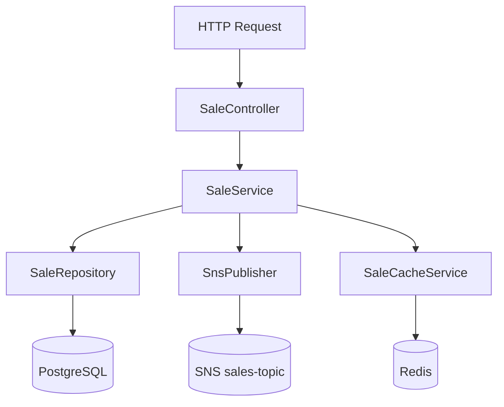
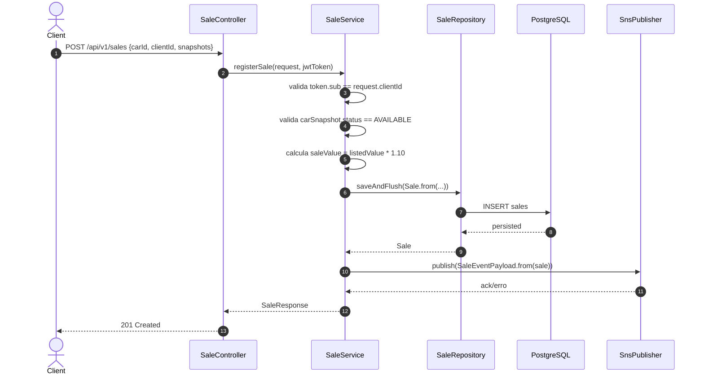
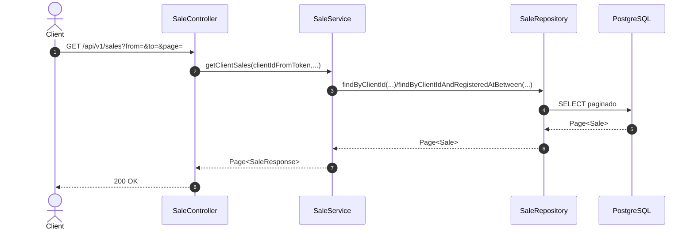
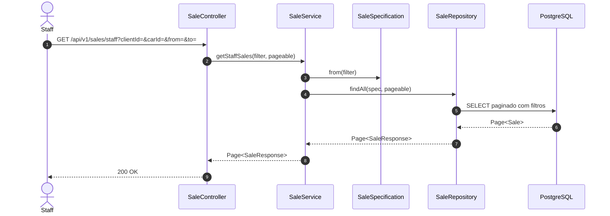
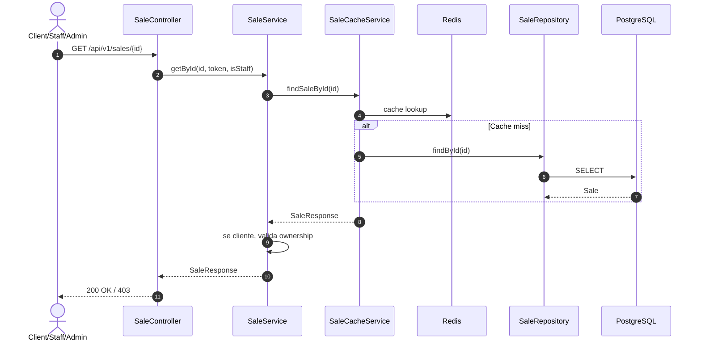
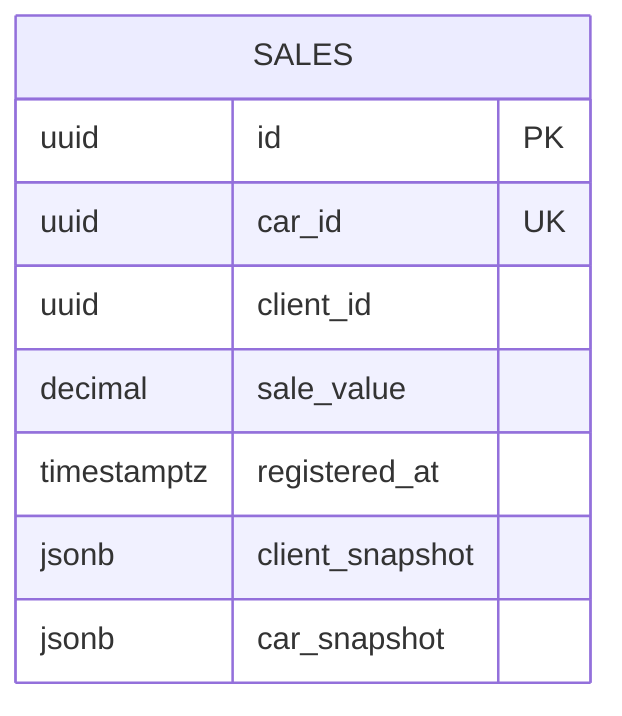

# sales-api — Documentacao Tecnica

## 1. Visao Geral
`sales-api` e o servico de vendas do `dealership-ai`: registra compras de carros, aplica taxa de transacao no valor final, persiste snapshots de cliente/veiculo no ato da venda e publica `SaleEventPayload` no SNS para processamento assíncrono (atualizacao de status do carro e workflow de invoice).

## 2. Stack de Tecnologias

| Tecnologia | Versao | Finalidade |
|------------|--------|------------|
| Java | 25 | Linguagem principal |
| Spring Boot | 4.0.5 | Runtime da API |
| Spring MVC | 4.0.5 (via Boot) | Endpoints REST |
| Spring Data JPA | 4.0.5 (via Boot) | Persistencia |
| PostgreSQL Driver | 42.x (via Boot) | Banco relacional |
| Flyway | 11.x (via Boot) | Migracoes SQL |
| Spring Security OAuth2 Resource Server | 4.0.5 (via Boot) | JWT/RBAC |
| Spring Data Redis | 4.0.5 (via Boot) | Cache de venda por ID |
| Resilience4j | 2.3.0 | Retry/CircuitBreaker para publicacao SNS |
| Spring Cloud AWS SNS | 4.0.0 | Publicacao de eventos de venda |
| springdoc-openapi | 3.0.2 | OpenAPI/Swagger |
| logstash-logback-encoder | 7.4 | Logging estruturado |
| Rest Assured | 6.0.0 | Testes HTTP |
| Instancio | 5.3.0 | Dados sinteticos |
| WireMock | 3.10.0 | Test doubles externos |
| JaCoCo | 0.8.13 | Cobertura (gate 90%) |
| PIT | 1.17.0 | Mutation test (gate 90%) |
| Docker | Dockerfile multi-stage | Empacotamento |
| Terraform | >= 1.5.0 (`infra/`) | Provisionamento AWS do servico |

## 3. Estrutura de Diretorios

```text
sales-api/
├── src/
│   ├── main/
│   │   ├── java/br/com/dealership/salesapi/
│   │   │   ├── config/                 # Security, Redis, OpenAPI, Resilience4j, handlers
│   │   │   ├── controller/             # SaleController (/api/v1/sales)
│   │   │   ├── domain/
│   │   │   │   ├── entity/             # Sale e snapshots
│   │   │   │   ├── exception/          # Excecoes de dominio
│   │   │   │   └── specification/      # Filtro staff
│   │   │   ├── dto/
│   │   │   │   ├── request/            # RegisterSaleRequest e filtros
│   │   │   │   └── response/           # SaleResponse + envelope Response<T>
│   │   │   ├── messaging/              # SnsPublisher + payload de evento
│   │   │   ├── repository/             # SaleRepository
│   │   │   ├── service/                # SaleService / SaleCacheService
│   │   │   └── web/                    # filtros HTTP/logging
│   │   └── resources/
│   │       ├── application.properties
│   │       └── db/migration/V1__create_sales_table.sql
│   └── test/
│       ├── java/br/...                 # Unit tests
│       └── java/integrated/            # Integration tests
├── infra/                              # Terraform (ECS + IAM + listener + env)
├── compose.yaml                        # Postgres local
├── Dockerfile
└── pom.xml
```

Arquivos relevantes:
- `SaleService.java`: regra de ownership, calculo de taxa e publish SNS.
- `messaging/SnsPublisher.java`: envio resiliente com fallback para erro de dominio.
- `domain/entity/Sale.java`: snapshot persistente da transacao.

## 4. Arquitetura
Padrao principal: **arquitetura em camadas + integracao event-driven**. O controller expõe endpoints de venda e consulta; o service valida ownership/disponibilidade, persiste `Sale` e publica evento em SNS; o repository acessa Postgres; o cache de leitura por ID fica em Redis via `SaleCacheService`.

Conceitos-chave:
- **REST**: contrato versionado em `/api/v1/sales`.
- **Snapshot na venda**: dados de cliente/carro em JSONB para rastreabilidade.
- **Event-driven**: apos `save`, publica `SaleEventPayload` em topico SNS.
- **Resilience**: retry + circuit breaker para falhas de publish SNS.
- **RBAC/Ownership**: cliente so acessa as proprias vendas; staff/admin consulta ampla.

### Diagrama de Arquitetura em Camadas


## 5. Fluxos Principais (Diagramas de Sequencia)

### Fluxo: registrar venda (POST /api/v1/sales)


### Fluxo: listar vendas do cliente (GET /api/v1/sales)


### Fluxo: listar vendas para staff (GET /api/v1/sales/staff)


### Fluxo: buscar venda por ID (GET /api/v1/sales/{id})


## 6. Modelos de Dados

```text
Entidade: Sale
├── id: UUID (PK)
├── carId: UUID (not null, unique: um carro vendido uma vez)
├── clientId: UUID (not null)
├── saleValue: BigDecimal (not null, > 0, inclui taxa)
├── registeredAt: Instant (not null)
├── clientSnapshot: JSONB ClientSnapshot
└── carSnapshot: JSONB CarSnapshot

Value Object: ClientSnapshot
├── firstName: String
├── lastName: String
├── cpf: String (11 digitos)
├── email: String
└── address: AddressSnapshot

Value Object: CarSnapshot
├── model/manufacturer/colors
├── manufacturingYear
├── optionalItems: List<String>
├── type/category
├── vin: String (17 chars)
├── listedValue: BigDecimal
└── status: CarStatus
```

Validacoes relevantes:
- `RegisterSaleRequest`: `carId != clientId`.
- `clientSnapshot.address` obrigatorio e validado.
- `carSnapshot.listedValue >= 0.01`.



## 7. Configuracao e Variaveis de Ambiente

| Variavel | Descricao | Obrigatoria | Exemplo |
|----------|-----------|-------------|---------|
| `SERVER_PORT` | Porta da API | Nao (default) | `8082` |
| `DATASOURCE_URL` | JDBC URL | Nao (default local) | `jdbc:postgresql://localhost:5432/salesdb` |
| `DATASOURCE_USERNAME` | Usuario DB | Nao (default) | `sales` |
| `DATASOURCE_PASSWORD` | Senha DB | Nao (default) | `sales` |
| `JWKS_URI` | URL de chaves JWT | Nao (default) | `http://localhost:8080/realms/dealership/protocol/openid-connect/certs` |
| `REDIS_HOST` | Host Redis | Nao (default) | `localhost` |
| `REDIS_PORT` | Porta Redis | Nao (default) | `6379` |
| `SNS_TOPIC_ARN` | ARN do topico de vendas | Nao (default) | `arn:aws:sns:us-east-1:000000000000:sale-events` |
| `AWS_REGION` | Regiao AWS | Nao (default) | `us-east-1` |

## 8. Como Executar Localmente

### Pre-requisitos
- Java 25+
- Docker + Docker Compose

### Passos
```bash
# 1. Clone o repositorio
git clone https://github.com/Joao-Victorsg/dealership-ai.git
cd dealership-ai/sales-api

# 2. Suba Postgres local
docker compose up -d

# 3. Execute a aplicacao
./mvnw spring-boot:run
```

## 9. Testes

### Testes Unitarios
```bash
./mvnw test
```

### Testes de Integracao
- Escopo: fluxo completo de venda, seguranca, persistencia e publish em ambiente de teste.
- Pre-requisitos: Docker ativo.

```bash
./mvnw failsafe:integration-test

# suite completa
./mvnw clean verify
```

Relatorios:
- JaCoCo: `target/site/jacoco/index.html`
- PIT: `target/pit-reports/index.html`

### Como Adicionar Novos Testes
- Unitarios: `src/test/java/br/com/dealership/salesapi/**` (`*Test`).
- Integracao: `src/test/java/integrated/**` (`*IT`) para Failsafe.
- Cenarios de dominio devem validar ownership, idempotencia de carro vendido e payload de evento.

## 10. Infraestrutura / IaC
`infra/` provisiona deploy do servico em ECS (task/service), log group, IAM, networking e listener de LB, alem de wiring com topico SNS compartilhado via remote state.

```bash
cd infra/
terraform init
terraform plan -var-file="env/dev.tfvars"
terraform apply -var-file="env/dev.tfvars"
```

## 11. Decisoes Tecnicas e Conceitos

| Decisao | Justificativa |
|---------|---------------|
| Persistir snapshots de cliente/carro na venda | Garante rastreabilidade historica independente de mudancas futuras em outros servicos |
| `car_id` unico em `sales` | Impoe regra de negocio "um carro so pode ser vendido uma vez" no banco |
| Calculo de taxa no backend de vendas | Centraliza regra financeira no bounded context correto |
| Publicacao SNS apos persistencia | Evita emitir evento sem venda efetivamente gravada |
| Cache de venda por ID em Redis | Acelera consultas frequentes com baixo risco de inconsistência |
